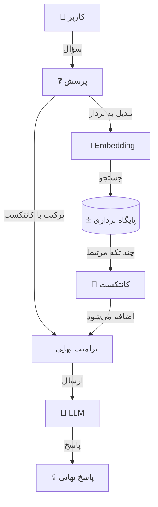

<div dir="rtl">

<div align="center">

</div>


---

<br>


<div align="center">

# مقدمه 📚

</div>


دو سال پیش که دیدم منبع فارسی درست‌حسابی برای یادگیری دیزاین پترن‌ها کمه، یه **ریپازیتوری** ساختم به اسم [دیزاین پترن به زبان آدمیزاد](https://github.com/3lf/design-patterns-for-humans).  استقبال خوبی هم ازش شد.

حالا داستان **مدل‌های زبانی بزرگ (LLMها)** هم همینه. این روزا اسم ChatGPT و Gemini و بقیه مدل‌ها همه جا هست و خیلی‌ها هم دارن ازشون استفاده می‌کنن. ولی قضیه اینه که چطور می‌شه **بهتر** ازشون کار کشید؟ چطور باید باهاشون حرف زد (یا به قول فنی‌ها، **پرامپت نوشت**) که دقیقاً همون چیزی که می‌خوایم رو بهمون بدن؟

دیدم اینجا هم جای یه راهنمای **ساده و خودمونی** خالیه. برای همین این ریپو رو درست کردم تا مثل دفعه قبل، سعی کنم روش‌های کار با LLMها رو **روون و راحت** توضیح بدم. از اینکه چطور یه **پرامپت خوب** بنویسیم شروع می‌کنیم و می‌ریم سراغ کلی **نکته و ترفند کاربردی** که می‌تونه کمک کنه نتیجه بهتری از این مدل‌ها بگیرید.

هدف اینه که چه برنامه‌نویس باشید، چه محتوا تولید کنید یا فقط کنجکاو باشید، بتونید راحت‌تر با این ابزارهای جدید کار کنید و ازشون به نفع خودتون استفاده کنید.

یه نکته کوچیک هم بگم: این راهنما قرار نیست جای داک رسمی سرویس‌ها رو بگیره، ولی هدفش اینه که مثال‌ها **قابل اجرا** باشن و حرف‌ها تا حد ممکن **قابل اتکا** و به‌روز گفته بشن. اگه جایی به مورد قدیمی/اشتباه خوردی، خیلی خوشحال می‌شم با Issue خبر بدی تا درستش کنیم.

---

<br>

<div align="center">

# فهرست مطالب ✨

</div>

*   **مقدمه 📚** [🔗](#مقدمه-)
*   **مدل‌های زبانی بزرگ (LLM) چی هستن اصلاً؟ 🤖** [🔗](#مدل‌های-زبانی-بزرگ-llm-چی-هستن-اصلاً-)
*   **مدل‌های زبانی بزرگ (LLM) چطوری کار می‌کنه؟ (زیر کاپوت چه خبره؟) 🏎️** [🔗](#مدل‌های-زبانی-بزرگ-llm-چطوری-کار-می‌کنه-زیر-کاپوت-چه-خبره-️)
    *   ۱. توکن (Token): آجرهای سازنده 🧱 [🔗](#۱-توکن-token-آجرهای-سازنده-)
    *   ۲. امبدینگ (Embedding): تبدیل کلمات به اعداد معنی‌دار 🗺️ [🔗](#۲-امبدینگ-embedding-تبدیل-کلمات-به-اعداد-معنی‌دار-️)
    *   ۳. احتمال کلمه بعدی (Next Token Prediction): پیش‌گویی آینده 🔮 [🔗](#۳-احتمال-کلمه-بعدی-next-token-prediction-پیش‌گویی-آینده-)
*   **پرامپت‌نویسی: یعنی چی؟ چطور به LLM دستور بدیم؟ ✍️** [🔗](#پرامپت‌نویسی-یعنی-چی-چطور-به-llm-دستور-بدیم-️)
    *   خب، چطور یه پرامپت خوب و کارراه‌انداز بنویسیم؟ 🏗 [🔗](#خب-چطور-یه-پرامپت-خوب-و-کارراه‌انداز-بنویسیم-)
    *   یه مثال ساده از پرامپت‌نویسی 🌍 [🔗](#یه-مثال-ساده-از-پرامپت‌نویسی-)
*   **چطور پرامپت‌های بهتری بنویسیم؟ (تکنیک‌های پیشرفته‌تر) 🚀** [🔗](#چطور-پرامپت‌های-بهتری-بنویسیم-تکنیک‌های-پیشرفته‌تر-)
    *   ۱. دستور و داده رو قاطی نکن! (استفاده از جداکننده‌ها) ✂️ [🔗](#۱-دستور-و-داده-رو-قاطی-نکن-استفاده-از-جداکننده‌ها-️)
    *   ۲. خروجی رو تو قالب دلخواهت بگیر (JSON، لیست، جدول و...) 🗂️ [🔗](#۲-خروجی-رو-تو-قالب-دلخواهت-بگیر-json-لیست-جدول-و-️)
    *   ۳. به مدل بگو با چه لحنی حرف بزنه (رسمی، خودمونی، طنزآمیز؟) 🎨 [🔗](#۳-به-مدل-بگو-با-چه-لحنی-حرف-بزنه-رسمی-خودمونی-طنزآمیز-)
    *   ۴. شرط بذار، بعد دستور بده! ✅ [🔗](#۴-شرط-بذار-بعد-دستور-بده-)
    *   ۵. با مثال بهش یاد بده چی می‌خوای (Few-Shot Prompting) 🚀 [🔗](#۵-با-مثال-بهش-یاد-بده-چی-می‌خوای-few-shot-prompting-)
    *   ۶. ازش بخواه قدم به قدم فکر کنه و بعد جواب بده 🧩 [🔗](#۶-ازش-بخواه-قدم-به-قدم-فکر-کنه-و-بعد-جواب-بده-)
    *   ۷. بار اول نشد؟ دوباره و دوباره امتحان کن! (تکرار و بهبود) 🔄 [🔗](#۷-بار-اول-نشد-دوباره-و-دوباره-امتحان-کن-تکرار-و-بهبود-)
*   **پارامترهای مهم در کار با LLMها ⚙️** [🔗](#پارامترهای-مهم-در-کار-با-llmها-️)
    *   مقدار Temperature (دمای خلاقیت / دقت) 🌡️ [🔗](#مقدار-temperature-دمای-خلاقیت--دقت-️)
    *   مقدار Top-p (نمونه‌برداری هسته‌ای / Nucleus Sampling) 🎲 [🔗](#مقدار-top-p-نمونه‌برداری-هسته‌ای--nucleus-sampling-)
    *   مقدار Frequency Penalty (جریمه تکرار کلمه) 🔄 [🔗](#مقدار-frequency-penalty-جریمه-تکرار-کلمه-)
    *   مقدار Presence Penalty (جریمه تکرار موضوع/توکن) 🚫 [🔗](#مقدار-presence-penalty-جریمه-تکرار-موضوعتوکن-)
    *   مقدار Top-k (گزینش از k تای برتر) 📝 [🔗](#مقدار-top-k-گزینش-از-k-تای-برتر-)
    *   خلاصه تفاوت پارامترها به زبان ساده 🤔 [🔗](#خلاصه-تفاوت-پارامترها-به-زبان-ساده-)
    *   یه پیشنهاد کاربردی در آخر 💡 [🔗](#یه-پیشنهاد-کاربردی-در-آخر-)
*   **سیستم پرامپت (System Prompt) 🤖** [🔗](#سیستم-پرامپت-system-prompt-)
    *   تعریف System Prompt 📌 [🔗](#تعریف-system-prompt-)
    *   چطور کار می‌کنه؟ ⚙️ [🔗](#چطور-کار-می‌کنه-️)
    *   چرا System Prompt مهمه؟ 🤔 [🔗](#چرا-system-prompt-مهمه-)
*   **تکنیک‌های پرامپت‌نویسی 📜** [🔗](#تکنیک‌های-پرامپت‌نویسی-)
    *   ۱. نقش‌دهی (Role Prompting) 🎭 [🔗](#۱-نقش‌دهی-role-prompting-)
    *   ۲. ارائه چند مثال (Few-Shot Prompting) 📚 [🔗](#۲-ارائه-چند-مثال-few-shot-prompting-)
    *   ۳. زنجیره تفکر (Chain of Thought Prompting - CoT) 🧠 [🔗](#۳-زنجیره-تفکر-chain-of-thought-prompting---cot-)
    *   ۴. درخت تفکر (Tree of Thoughts - ToT) 🌳 [🔗](#۴-درخت-تفکر-tree-of-thoughts---tot-)
    *   ۵. استدلال و عمل (ReAct - Reasoning and Acting) ⚙️ [🔗](#۵-استدلال-و-عمل-react---reasoning-and-acting-️)
    *   ۶. خود-سازگاری (Self-Consistency Prompting) 🔁 [🔗](#۶-خود-سازگاری-self-consistency-prompting-)
    *   تکنیک‌های پیشرفته (مختص حرفه‌ای‌ها) 🧪 [🔗](#تکنیک‌های-پیشرفته-مختص-حرفه‌ای‌ها-)
    *   نکات تکمیلی و پایانی ✨ [🔗](#نکات-تکمیلی-و-پایانی-)
*   **مشکلات معروف LLMها ⚠️** [🔗](#مشکلات-معروف-llmها-️)
    *   ۱. ناتوانی در ارائه منابع معتبر (Citing Sources) 📚 [🔗](#۱-ناتوانی-در-ارائه-منابع-معتبر-citing-sources-)
    *   ۲. تعصب در پاسخ‌ها (Bias) 🎭 [🔗](#۲-تعصب-در-پاسخ‌ها-bias-)
    *   ۳. توهمات یا تولید اطلاعات ساختگی (Hallucinations) 🌈 [🔗](#۳-توهمات-یا-تولید-اطلاعات-ساختگی-hallucinations-)
    *   ۴. اشتباه در محاسبات ریاضی (Math Errors) ➗ [🔗](#۴-اشتباه-در-محاسبات-ریاضی-math-errors-)
    *   ۵. هک پرامپت (Prompt Hacking) 🛠️ [🔗](#۵-هک-پرامپت-prompt-hacking-️)
    *   ۶. محدودیت‌های پنجره محتوایی (Context Window) ⏳ [🔗](#۶-محدودیت‌های-پنجره-محتوایی-context-window-)
    *   ۷. دانش قدیمی یا محدودیت زمانی (Outdated Knowledge) ⏰ [🔗](#۷-دانش-قدیمی-یا-محدودیت-زمانی-outdated-knowledge-)
    *   ۸. عدم درک مفاهیم عمیق یا حالات احساسی ❤️‍🩹 [🔗](#۸-عدم-درک-مفاهیم-عمیق-یا-حالات-احساسی-️‍)
*   **چطور دقت و امنیت LLM رو بالاتر ببریم؟ 🛡️** [🔗](#چطور-دقت-و-امنیت-llm-رو-بالاتر-ببریم-️)
    *   ۱. پرامپت‌نویسی هوشمند (Smart Prompting) 📝 [🔗](#۱-پرامپت‌نویسی-هوشمند-smart-prompting-)
    *   ۲. نظارت بر خروجی‌ها (Moderation & Policy) 🚦 [🔗](#۲-نظارت-بر-خروجی‌ها-moderation--policy-)
    *   ۳. فکت‌چک بیرونی (External Fact-Checking) 🔍 [🔗](#۳-فکت‌چک-بیرونی-external-fact-checking-)
    *   ۴. ترکیب LLM با ابزارهای تخصصی (Tool Integration) 🛠️ [🔗](#۴-ترکیب-llm-با-ابزارهای-تخصصی-tool-integration-️)
    *   ۵. به‌روزرسانی دوره‌ای (Regular Fine-Tuning) 🔄 [🔗](#۵-به‌روزرسانی-دوره‌ای-regular-fine-tuning-)
    *   ۶. درخواست Self-Evaluation از خود مدل 🤔 [🔗](#۶-درخواست-self-evaluation-از-خود-مدل-)
    *   ۷. خلاصه‌سازی متناوب و مدیریت حافظه (Context Management) 🗂️ [🔗](#۷-خلاصه‌سازی-متناوب-و-مدیریت-حافظه-context-management-️)
    *   ۸. راهکارهای پیشرفته و لایه‌لایه (Defense in Depth) 🛡️ [🔗](#۸-راهکارهای-پیشرفته-و-لایه‌لایه-defense-in-depth-️)
    *   جمع‌بندی ✨ [🔗](#جمع‌بندی-)
*   **ارزیابی پرامپت و خروجی LLM (از کجا بفهمیم خوبه؟) 📏** [🔗](#ارزیابی-پرامپت-و-خروجی-llm-از-کجا-بفهمیم-خوبه-)
    *   ۱. انواع روش‌های ارزیابی 🕵️‍♂️ [🔗](#۱-انواع-روش‌های-ارزیابی-️‍️)
    *   ۲. طراحی معیارهای ارزیابی (Rubric) 📝 [🔗](#۲-طراحی-معیارهای-ارزیابی-rubric-)
    *   ۳. تست A/B: کدوم پرامپت بهتره؟ 🅰️/🅱️ [🔗](#۳-تست-ab-کدوم-پرامپت-بهتره-🅰️🅱️)
*   **معماری و شخصی‌سازی (Fine-tuning vs RAG) 🏗️** [🔗](#معماری-و-شخصی‌سازی-fine-tuning-vs-rag-️)
    *   ۱. داستان زندگی یک LLM: سه مرحله اصلی 👶👨‍🎓🕵️ [🔗](#۱-داستان-زندگی-یک-llm-سه-مرحله-اصلی-‍️)
    *   ۲. کی لازم داریم فاین‌تیون کنیم؟ 🤷 [🔗](#۲-کی-لازم-داریم-فاین‌تیون-کنیم-)
    *   ۳. معجزه LoRA و QLoRA (چطور بدون ورشکستگی مدل بسازیم؟) 📉 [🔗](#۳-معجزه-lora-و-qlora-چطور-بدون-ورشکستگی-مدل-بسازیم-)
    *   ۴. دیتا برای فاین‌تیون چه‌شکلیه؟ 📊 [🔗](#۴-دیتا-برای-فاین‌تیون-چه‌شکلیه-)
    *   ۵. مراحل عملی فاین‌تیون (نقشه راه) 🗺️ [🔗](#۵-مراحل-عملی-فاین‌تیون-نقشه-راه-️)
    *   ۶. پس RAG (بازیابی اطلاعات) چیه؟ 🌐 [🔗](#۶-پس-rag-بازیابی-اطلاعات-چیه-)
    *   ۷. مقایسه نهایی: فاین‌تیون یا RAG؟ ⚔️ [🔗](#۷-مقایسه-نهایی-فاین‌تیون-یا-rag-️)
*   **مهندسی کانتکست (Context Engineering) 🧠** [🔗](#مهندسی-کانتکست-context-engineering-)
*   **بخش RAG در عمل: زیر کاپوت چه خبره؟ 🏗️** [🔗](#بخش-rag-در-عمل-زیر-کاپوت-چه-خبره-️)
    *   ۱. معماری ساده RAG (یه نقشه گنج) 🗺️ [🔗](#۱-معماری-ساده-rag-یه-نقشه-گنج-️)
    *   ۲. استراتژی‌های Chunking (تیکه‌تیکه کردن هوشمند) 🍰 [🔗](#۲-استراتژی‌های-chunking-تیکه‌تیکه-کردن-هوشمند-)
    *   ۳. روش‌های بازیابی (Retrieval Strategies) 🎣 [🔗](#۳-روش‌های-بازیابی-retrieval-strategies-)
    *   ۴. ارزیابی RAG (از کجا بفهمیم خوبه؟) ⚖️ [🔗](#۴-ارزیابی-rag-از-کجا-بفهمیم-خوبه-️)
*   **ابزارها و خروجی ساختاریافته (Function Calling) 🛠️** [🔗](#ابزارها-و-خروجی-ساختاریافته-function-calling-️)
    *   ۱. انواع ابزارها (Tools): دست‌های رباتیک 🦾 [🔗](#۱-انواع-ابزارها-tools-دست‌های-رباتیک-)
    *   ۲. پروتکل MCP (Model Context Protocol) 🔌 [🔗](#۲-پروتکل-mcp-model-context-protocol-)
    *   ۳. طراحی Schema 📝 [🔗](#۳-طراحی-schema-)
    *   ۴. خروجی ساختاریافته (Structured Output) 🏗️ [🔗](#۴-خروجی-ساختاریافته-structured-output-️)
    *   ۵. مثال کاربردی با LangChain (پایتون) 🐍 [🔗](#۵-مثال-کاربردی-با-langchain-پایتون-)
    *   ۶. هندل کردن خطاها (وقتی پلاستیک مغز می‌سوزه!) 💥 [🔗](#۶-هندل-کردن-خطاها-وقتی-پلاستیک-مغز-می‌سوزه-)
*   **دو روش ساخت پرامپت (با کمک ابزارها) 🚀** [🔗](#دو-روش-ساخت-پرامپت-با-کمک-ابزارها-)
    *   ۱. استفاده از پرامپت‌های پرامپت‌ساز 🛠️ [🔗](#۱-استفاده-از-پرامپت‌های-پرامپت‌ساز-️)
    *   ۲. استفاده از سایت پرامپت‌ساز آنلاین 🌐 [🔗](#۲-استفاده-از-سایت-پرامپت‌ساز-آنلاین-)
*   **انتخاب مدل و استراتژی ارائه‌دهنده (Provider) 🧭** [🔗](#انتخاب-مدل-و-استراتژی-ارائه‌دهنده-provider-)
    *   معیارهای انتخاب مدل (چک لیست واقعی) 🧰 [🔗](#معیارهای-انتخاب-مدل-چک-لیست-واقعی-)
    *   مدل های بسته یا متن باز؟ (کی کدوم به صرفه تره؟) ⚖️ [🔗](#مدل-های-بسته-یا-متن-باز-کی-کدوم-به-صرفه-تره-️)
    *   مدل های Chat vs Reasoning vs Realtime (صوتی) 🎛️ [🔗](#مدل-های-chat-vs-reasoning-vs-realtime-صوتی-️)
    *   یه مسیر پیشنهادی برای انتخاب (بدون وسواس) 🗺️ [🔗](#یه-مسیر-پیشنهادی-برای-انتخاب-بدون-وسواس-️)
*   **دسترسی رایگان به API برای استفاده از LLMها 🌐** [🔗](#دسترسی-رایگان-به-api-برای-استفاده-از-llmها-)
    *   ۱. استفاده از سرویس‌های آنلاین 🌍 [🔗](#۱-استفاده-از-سرویس‌های-آنلاین-)
    *   ۲. اجرا کردن مدل روی لپ‌تاپ با Ollama 🖥️ [🔗](#۲-اجرا-کردن-مدل-روی-لپ‌تاپ-با-ollama-️)
    *   ۳. اجرا کردن مدل با ظاهر گرافیکی توی LM Studio 🎛️ [🔗](#۳-اجرا-کردن-مدل-با-ظاهر-گرافیکی-توی-lm-studio-️)
*   **کمک کردن به این پروژه! 🤝** [🔗](#کمک-کردن-به-این-پروژه-)

---

<div align="center">

# مدل‌های زبانی بزرگ (LLM) چی هستن اصلاً؟ 🤖

</div>

خب، بریم سراغ اصل مطلب: این **LLMها** (مخفف **Large Language Model**) که این‌قدر اسمشون رو می‌شنویم، چی هستن؟

خیلی ساده بخوایم بگیم، LLM یک **مدل یادگیری عمیق**ه (معمولاً از خانواده‌ی Transformer) که روی **حجم خیلی زیادی** از متن و کد آموزش دیده. کار اصلیش اینه که با توجه به چیزایی که تا اینجا دیده، **احتمال توکن بعدی** رو حدس بزنه؛ و از همین راه می‌تونه متن و کد تولید کنه.

یه نکته‌ی مهم: وقتی می‌گیم «می‌فهمه»، منظور «فهم انسانی» نیست؛ بیشتر یعنی الگوهای زبانی رو خیلی خوب یاد گرفته. ضمن اینکه بعضی مدل‌ها فقط **متنی** هستن، بعضی‌ها هم **چندوجهی**‌ان (متن + تصویر/صوت و...).

**خب حالا این LLMها دقیقاً چه کارایی ازشون برمیاد؟**
کارهای خیلی زیادی می‌تونن بکنن، مثلاً:

*   **متن بنویسن** (مثل مقاله، ایمیل، داستان)، یا متن‌های طولانی رو **خلاصه کنن**.
*   به **سوال‌هاتون** (تقریباً در هر زمینه‌ای) جواب بدن.
*   متن‌ها رو به زبان‌های مختلف **ترجمه** کنن.
*   مثل یه آدم باهاتون **چت کنن** و گفتگو رو ادامه بدن.
*   **داده‌ها رو تحلیل کنن** و الگوهای داخلشون رو پیدا کنن.
*   براتون **کد بنویسن**، کدتون رو تکمیل کنن، یا اشکالاتش رو پیدا کنن (دیباگ کنن).
*   و اگه مدل چندوجهی باشه، حتی می‌تونه با **تصویر/صوت** هم کار کنه (مثل تولید یا تحلیل).

خلاصه کلام: **LLM یه سیستمه که ورودی شما رو می‌گیره، پردازش می‌کنه و یه خروجی مرتبط و (معمولاً) مفید تحویل می‌ده.**

نکته کلیدی اینجاست: **کیفیت خروجی خیلی به کیفیت ورودی (همون پرامپت) بستگی داره.** یعنی اگه می‌خوای بهترین جواب رو بگیری، باید یاد بگیری چطور **درست و حسابی پرامپت بنویسی** و خواسته‌ت رو واضح به مدل بگی. این همون مهارتیه که قراره توی بخش‌های بعدی بیشتر در موردش حرف بزنیم.

<br>

---

<br>

<div align="center">

# مدل‌های زبانی بزرگ (LLM) چطوری کار می‌کنه؟ (زیر کاپوت چه خبره؟) 🏎️

</div>

شاید براتون سوال شده باشه که این مدل‌ها واقعاً چطوری این همه چیز رو می‌دونن و جواب می‌دن؟ جادو می‌کنن؟ 🧙‍♂️ نه! همه‌چیز ریاضی و احتمالاته.

بیاید خیلی ساده و خودمونی **موتور** این ماشین رو باز کنیم و ببینیم توش چه خبره. کلاً ۳ تا مفهوم اصلی داریم که اگه بفهمیم، تقریباً کل داستان دستمون میاد:

<br>

<div align="center">

## ۱. توکن (Token): آجرهای سازنده 🧱

</div>

ما آدما جملات رو به صورت "کلمه به کلمه" می‌خونیم. ولی LLMها متن رو به تیکه‌های کوچیک‌تری به اسم **توکن (Token)** می‌شکنن.

*   تو انگلیسی هم خیلی وقت‌ها یک کلمه می‌تونه چند توکن بشه (به‌خصوص کلمات طولانی یا کم‌مصرف).
*   تو فارسی هم همینطوره و ممکنه یک کلمه به چند تکه شکسته بشه.

**نکته:** اینکه دقیقاً کلمات چطوری به توکن تبدیل می‌شن، به **Tokenizer** هر مدل بستگی داره؛ پس مثال‌ها اینجا بیشتر برای «تصویر ذهنی»‌ان، نه یک قانون صددرصد.

**مثال:**
کلمه **"خوشحالم"** ممکنه برای مدل به این صورت شکسته بشه: `خوش` + `حال` + `م`.

پس مدل وقتی داره متن رو می‌خونه یا می‌نویسه، داره با این آجرهای کوچیک (توکن‌ها) کار می‌کنه، نه لزوماً کل کلمات.

---

<div align="center">

## ۲. امبدینگ (Embedding): تبدیل کلمات به اعداد معنی‌دار 🗺️

</div>

کامپیوتر که معنی "عشق" یا "درخت" رو نمی‌فهمه! اون فقط عدد می‌فهمه.
اینجا **امبدینگ** وارد میشه. امبدینگ یعنی تبدیل هر توکن به یه **لیست از اعداد** (بردار).

ولی نکته جالبش اینه: کلماتی که معنیشون به هم نزدیکه، اعداشون هم به هم نزدیکه! 😍

**یه مثال ساده:**
فرض کنید یه نقشه بزرگ داریم.
*   توی این نقشه، کلمه **"پادشاه"** خیلی نزدیک به **"ملکه"** قرار می‌گیره.
*   کلمه **"سیب"** نزدیک به **"پرتقال"** قرار می‌گیره (چون هر دو میوه‌ن).
*   ولی **"سیب"** از **"ماشین"** خیلی دوره.

این مدل‌ها با این روش، به شکل **آماری** «نزدیکی معنایی» و رابطه بین کلمات رو یاد می‌گیرن.

---

<div align="center">

## ۳. احتمال کلمه بعدی (Next Token Prediction): پیش‌گویی آینده 🔮

</div>

کل کاری که یه LLM انجام میده (با اون همه ابهتش!) در واقع اینه:
**با توجه به چیزایی که تا الان گفتیم، کلمه (توکن) بعدی چی می‌تونه باشه؟**

مدل میاد بر اساس تمام چیزایی که یاد گرفته، برای کلمه‌های بعدی **احتمال (Probability)** تعیین می‌کنه.

**مثال:**
فرض کنید جمله اینه: `یه روز خوب میاد که ما ...`
مدل پیش خودش حساب کتاب می‌کنه:
*   **برنده** بشیم (احتمال: ۵٪)
*   **خوشحال** بشیم (احتمال: ۲۰٪)
*   **آزاد** بشیم (احتمال: ۱۵٪)
*   ...

و بعد بر اساس تنظیماتی که داره (مثل همون Temperature که بعداً می‌گیم)، یکی رو انتخاب می‌کنه و می‌ذاره جلوی جمله. بعد دوباره برای کلمه بعدی همین کار رو تکرار می‌کنه.

**نتیجه:**
اگه بتونیم ورودی (پرامپت) رو طوری بدیم که احتمال کلماتِ درست رو بالا ببریم، مدل دقیقاً همون چیزی رو می‌گه که ما می‌خوایم! اینجاست که **مهندسی پرامپت** مهم می‌شه. 😎

<br>

---

<br>

<div align="center">

# پرامپت‌نویسی: یعنی چی؟ چطور به LLM دستور بدیم؟ ✍️

</div>

پرامپت در واقع همون **دستور یا سوالیه** که شما به LLM می‌دین. مثل اینکه بخوای به یه دستیار خیلی باهوش بگی دقیقاً چی کار کنه یا چه اطلاعاتی بهت بده. این دستور می‌تونه یه سوال ساده باشه، یه درخواست برای نوشتن متن، خلاصه‌کردن یه مطلب، یا هر چیز دیگه‌ای.

یه قانون خیلی ساده ولی مهم اینجا وجود داره: **هر چی پرامپت شما واضح‌تر، دقیق‌تر و حساب‌شده‌تر باشه، معمولاً جوابی هم که از LLM می‌گیرید بهتر و به درد بخورتره.** مثل این می‌مونه که آدرس دقیق بدی تا به مقصد برسی؛ اگه آدرس رو کلی و نامفهوم بدی، معلوم نیست کجا سر در میاری!

---

<br>

<div align="center">

## خب، چطور یه پرامپت خوب و کارراه‌انداز بنویسیم؟ 🏗

</div>

برای اینکه LLM بهترین جواب ممکن رو بهتون بده، سعی کنید پرامپت‌هاتون این ویژگی‌ها رو داشته باشن:

*   **صاف و پوست‌کنده منظورتون رو بگید:** از کلی‌گویی و حرفای مبهم دوری کنید. دقیقاً بگید چی می‌خواید.
*   **شرایط و چارچوب رو مشخص کنید:** به مدل بگید جواب رو تو چه قالبی می‌خواید؟ (مثلاً لیست باشه، جدول باشه، کد باشه؟). لحنش چطور باشه؟ (رسمی، دوستانه، طنز؟). محدودیتی داره؟ (مثلاً طول جواب بیشتر از ۱۰۰ کلمه نباشه).
*   **اگه لازمه، جزئیات یا مثال بزنید:** گاهی یه مثال کوچیک می‌تونه به مدل کمک کنه دقیقاً بفهمه دنبال چی هستید و کارتون رو خیلی بهتر راه بندازه.
*   **ساده و سرراست بنویسید:** جمله‌های پیچیده و تودرتو ممکنه مدل رو گیج کنه. سعی کنید روان و مستقیم حرف بزنید.

---

<br>

<div align="center">

## یه مثال ساده از پرامپت‌نویسی 🌍

</div>

بذارید با یه مثال ببینیم منظور چیه:

**فرض کنید می‌خوایم یه ایمیل رسمی برای درخواست مرخصی بنویسیم.**

**پرامپت ما می‌تونه این باشه:**
`یه ایمیل رسمی و مودبانه به مدیرم بنویس برای درخواست مرخصی ۳ روزه. دلیل مرخصی رو هم توی ایمیل بیار (مثلاً: به دلیل مسائل شخصی).`

**جواب احتمالی LLM:**

```text
موضوع: درخواست مرخصی

جناب آقای/سرکار خانم [نام مدیر]،
با سلام و احترام،

احتراماً به استحضار می‌رساند، اینجانب [نام شما] قصد دارم از تاریخ [تاریخ شروع] به مدت سه روز تا تاریخ [تاریخ پایان] به دلیل مسائل شخصی از مرخصی استحقاقی خود استفاده نمایم.

پیشاپیش از حسن توجه و موافقت حضرتعالی کمال تشکر را دارم.

با احترام،
[نام شما]
[سمت شما (اختیاری)]
[تاریخ]
```

ببینید چطور با یه پرامپت نسبتاً واضح، یه خروجی کاملاً مناسب و کاربردی گرفتیم. توی بخش‌های بعدی، تکنیک‌های پیشرفته‌تری برای نوشتن پرامپت‌های قوی‌تر رو یاد می‌گیریم.

<br>

---

<br>

<div align="center">

# چطور پرامپت‌های بهتری بنویسیم؟ (تکنیک‌های پیشرفته‌تر) 🚀

</div>

خب، حالا که اصول اولیه پرامپت‌نویسی رو گفتیم، وقتشه یه کم حرفه‌ای‌تر بشیم! 😎
یادتونه گفتیم هرچی پرامپت دقیق‌تر باشه، جواب بهتری می‌گیریم؟ این چند تا تکنیک بهتون کمک می‌کنه پرامپت‌هاتون رو **واضح‌تر، دقیق‌تر و قوی‌تر** کنید تا LLM دقیقاً همون کاری که می‌خواید رو براتون انجام بده.

---

<br>

<div align="center">

## ۱. دستور و داده رو قاطی نکن! (استفاده از جداکننده‌ها) ✂️

</div>

بعضی وقتا شما هم یه **دستور** به مدل می‌دین (مثلاً "این متنو خلاصه کن") و هم یه **تکه داده** (همون متنی که باید خلاصه بشه). اگه این دوتا رو همینجوری پشت سر هم بنویسید، مدل ممکنه قاطی کنه که کدوم دستوره و کدوم داده!

بهترین کار اینه که با یه **جداکننده واضح**، این دو بخش رو از هم سوا کنید. رایج‌ترین و ساده‌ترین راه، استفاده از سه تا بک‌تیک (```) هست:

**مثال:** فرض کنید می‌خواید یه پاراگراف رو خلاصه کنید.

````markdown
لطفاً پاراگراف زیر رو در یک جمله خلاصه کن:

```text
مدل‌های زبانی بزرگ یا LLMها، نوعی هوش مصنوعی هستند که بر روی حجم عظیمی از داده‌های متنی آموزش دیده‌اند. آن‌ها می‌توانند زبان انسان را درک کرده، تولید کنند و وظایف مختلفی مانند ترجمه، خلاصه‌سازی و پاسخ به سوالات را انجام دهند. توانایی آن‌ها در درک مفاهیم پیچیده و تولید متن منسجم، آن‌ها را به ابزاری قدرتمند در حوزه‌های مختلف تبدیل کرده است.
```
````

**روش‌های دیگه هم هست؟**
آره، می‌تونید از جداکننده‌های دیگه مثل سه تا هشتگ (`###`) یا حتی تگ‌های ساده XML/HTML (مثل `<text_to_summarize> ... </text_to_summarize>`) هم استفاده کنید. مهم اینه که یه مرز مشخص بین دستور و داده‌تون بذارید.

**چرا این کار مهمه؟**
چون به مدل کمک می‌کنه **دقیقاً بفهمه** قراره روی کدوم قسمت از متن کار کنه و چه کاری رو انجام بده. اینطوری احتمال خطا و کج‌فهمی خیلی کمتر می‌شه.

---

<br>

<div align="center">

## ۲. خروجی رو تو قالب دلخواهت بگیر (JSON، لیست، جدول و...) 🗂️

</div>

گاهی وقتا جواب مدل رو نمی‌خواید همینجوری یه متن ساده باشه. مثلاً اگه برنامه‌نویس باشید، شاید لازم داشته باشید جواب رو تو فرمت **JSON** بگیرید تا راحت تو کدتون ازش استفاده کنید. یا شاید بخواید جواب به صورت یه **لیست شماره‌دار** یا یه **جدول** باشه.

**خیلی راحت می‌تونید تو پرامپت از مدل بخواید خروجی رو تو فرمت خاصی بهتون بده.**

**مثال: گرفتن خروجی JSON**

````markdown
اطلاعات کتاب زیر رو به صورت یک آبجکت JSON با کلیدهای `title`, `author`, و `year` بهم بده:

```text
نام کتاب: بوف کور
نویسنده: صادق هدایت
سال انتشار: ۱۳۱۵
```
````

**پاسخ احتمالی مدل:**

```json
{
  "title": "بوف کور",
  "author": "صادق هدایت",
  "year": 1315
}
```

**مثال دیگه: درخواست لیست**
`مزایای اصلی یادگیری پایتون رو به صورت یه لیست شماره‌دار برام بنویس.`

**چرا این کار مفیده؟**
*   جوابی که می‌گیرید **استاندارد و قابل پیش‌بینی** می‌شه.
*   اگه قراره خروجی رو جای دیگه‌ای (مثل کد، دیتابیس، اکسل) استفاده کنید، کارتون **خیلی راحت‌تر** می‌شه.

---

<br>

<div align="center">

## ۳. به مدل بگو با چه لحنی حرف بزنه (رسمی، خودمونی، طنزآمیز؟) 🎨

</div>

یکی از قابلیت‌های باحال LLMها اینه که می‌تونن با **لحن‌ها و شخصیت‌های مختلف** براتون متن تولید کنن! فقط کافیه تو پرامپت بهش بگید چه لحنی مد نظرتونه.

**مثال: لحن دوستانه**

```markdown
با یه لحن ساده و خودمونی توضیح بده چطوری می‌تونم یه چای خوب دم کنم. انگار داری برای دوستت توضیح می‌دی.
```

**مثال: لحن رسمی**

```markdown
یک پاراگراف رسمی در مورد اهمیت حفظ حریم خصوصی در دنیای دیجیتال بنویس.
```

**مثال: لحن خاص (شخصیت‌سازی)**

```markdown
فرض کن یه دزد دریایی هستی! توضیح بده چرا پیدا کردن گنج مهمه.
```

**نتیجه چیه؟**
مدل سعی می‌کنه از کلمات و جمله‌بندی‌هایی استفاده کنه که اون **حس و حال و لحن درخواستی** شما رو منتقل کنه. این برای تولید محتوای متناسب با مخاطب یا هدف خاص، عالیه!

---

<br>

<div align="center">

## ۴. شرط بذار، بعد دستور بده! ✅

</div>

می‌تونید از LLM بخواید **اول یه سری شرایط رو چک کنه** و بعد بر اساس نتیجه اون شرایط، یه کاری رو انجام بده یا یه جوابی بده.

**مثال:** فرض کنید یه سیستم ساده برای پیشنهاد فیلم دارید.

```markdown
لطفاً بررسی کن:
اگر ژانر مورد علاقه کاربر "کمدی" است و رده‌بندی سنی فیلم "زیر ۱۸ سال" است، پیشنهاد بده فیلم "پسر دلفینی" رو ببینه.

ژانر مورد علاقه: کمدی
رده‌بندی سنی فیلم: زیر ۱۸ سال
```

**جواب احتمالی:**
`پیشنهاد می‌کنم فیلم "پسر دلفینی" رو ببینید.`

**مثال دیگه (چک کردن متن):**

```markdown
اگر متن زیر شامل کلمه "تخفیف" بود، بنویس "پیشنهاد ویژه وجود دارد!". در غیر این صورت، بنویس "پیشنهاد خاصی یافت نشد."

متن:
همین حالا ثبت نام کنید و از ۱۰ درصد تخفیف ویژه بهره‌مند شوید!
```

**جواب احتمالی:**
`پیشنهاد ویژه وجود دارد!`

**به چه دردی می‌خوره؟**
برای پیاده‌سازی **منطق‌های ساده و تصمیم‌گیری‌های شرطی** توی خود پرامپت خیلی کاربردیه و می‌تونه جواب‌ها رو هدفمندتر کنه.

---

<br>

<div align="center">

## ۵. با مثال بهش یاد بده چی می‌خوای (Few-Shot Prompting) 🚀

</div>

این یکی از تکنیک‌های خیلی قدرتمنده! به جای اینکه فقط دستور بدید، **چند تا مثال از کاری که می‌خواید انجام بشه رو به مدل نشون می‌دید.** مدل از روی مثال‌های شما الگو رو یاد می‌گیره و کار رو برای ورودی جدیدتون انجام می‌ده. به این روش می‌گن **Few-Shot Prompting** (یعنی یادگیری با چند مثال).

**مثال: تشخیص حس متن (Sentiment Analysis)**

```markdown
حس متن‌های زیر رو مشخص کن (مثبت، منفی، خنثی).

متن: من عاشق این رستورانم! غذاش عالیه!
حس: مثبت

متن: متاسفانه کیفیت خدمات خیلی پایین بود.
حس: منفی

متن: این کتاب درباره تاریخ ایران است.
حس: خنثی

حالا حس این متن رو بگو:
متن: فیلم خوبی بود، ارزش دیدن داره.
حس: ؟
```

**پاسخ احتمالی:**
`مثبت`

**مثال دیگه: تبدیل لحن**

```markdown
لحن جمله زیر رو از رسمی به خودمونی تغییر بده.

جمله رسمی: احتراما به استحضار می‌رساند جلسه فردا لغو گردیده است.
جمله خودمونی: بچه‌ها، جلسه فردا کنسله!

حالا این جمله رو خودمونی کن:
جمله رسمی: لطفاً در اسرع وقت نسبت به تکمیل فرم اقدام فرمایید.
جمله خودمونی: ؟
```

**پاسخ احتمالی:**
`لطفاً هر چی زودتر فرم رو پر کنید.`

**کی به درد می‌خوره؟**
*   وقتی می‌خواید مدل یه **الگوی خاص** رو یاد بگیره (مثل طبقه‌بندی، تبدیل فرمت، تشخیص حس).
*   وقتی توضیح دادن دقیق کاری که می‌خواید سخته، اما **نشون دادنش با مثال راحته**.
*   وقتی می‌خواید خروجی **دقیقاً شبیه مثال‌های شما** باشه.

---

<br>

<div align="center">

## ۶. ازش بخواه قدم به قدم فکر کنه و بعد جواب بده 🧩

</div>

گاهی اوقات، مخصوصاً برای مسائل پیچیده‌تر (مثل مسائل ریاضی یا استدلالی)، اگه از مدل بخواید **قبل از دادن جواب نهایی، مراحل فکر کردنش رو هم بنویسه**، نتیجه بهتری می‌گیرید. انگار دارید بهش می‌گید "بلند بلند فکر کن!". به این تکنیک گاهی **Chain-of-Thought (زنجیره فکر)** هم می‌گن.

**مثال: حل مسئله ریاضی**

```markdown
لطفاً مسئله زیر رو مرحله به مرحله حل کن و در نهایت جواب آخر رو بنویس:

سوال: قیمت یک دفتر ۱۲ هزار تومان است و قیمت یک خودکار ۸ هزار تومان. اگر ۳ دفتر و ۲ خودکار بخریم، کل هزینه چقدر می‌شود؟

مراحل حل:
۱. محاسبه قیمت ۳ دفتر: ۳ * ۱۲۰۰۰ = ۳۶۰۰۰ تومان
۲. محاسبه قیمت ۲ خودکار: ۲ * ۸۰۰۰ = ۱۶۰۰۰ تومان
۳. محاسبه هزینه کل: ۳۶۰۰۰ + ۱۶۰۰۰ = ۵۲۰۰۰ تومان

جواب نهایی: ۵۲۰۰۰ تومان
```
*(توجه: در پرامپت واقعی، شما فقط سوال رو می‌دید و از مدل می‌خواید مراحل و جواب رو بنویسه. اینجا فقط برای نمایش کامل آوردم)*

**چرا این روش خوبه؟**
*   به مدل **فرصت می‌ده** تا مسئله رو تجزیه کنه و احتمال اشتباهش کمتر می‌شه.
*   اگه جواب نهایی اشتباه بود، می‌تونید **مراحل رو ببینید** و بفهمید کجای کار ایراد داشته.
*   برای مسائلی که نیاز به **استدلال چند مرحله‌ای** دارن، خیلی کمک‌کننده‌ست.

---

<br>

<div align="center">

## ۷. بار اول نشد؟ دوباره و دوباره امتحان کن! (تکرار و بهبود) 🔄

</div>

خیلی مهمه که بدونید: **نوشتن پرامپت یه مهارته و مثل هر مهارت دیگه‌ای با تمرین بهتر می‌شه!** خیلی کم پیش میاد که با همون اولین پرامپتی که می‌نویسید، دقیقاً به بهترین جواب ممکن برسید.

پس **اصلاً ناامید نشید!** فرایند کار معمولاً اینطوریه:

1.  **یه پرامپت اولیه بنویسید** و نتیجه رو ببینید.
2.  **جواب مدل رو تحلیل کنید:** آیا دقیقاً همونیه که می‌خواستید؟ کجاش خوبه؟ کجاش ایراد داره؟ آیا چیزی رو اشتباه فهمیده؟
3.  **پرامپت‌تون رو اصلاح کنید:** شاید باید واضح‌تر بگید چی می‌خواید، شاید باید مثال اضافه کنید، شاید باید لحن رو مشخص کنید، یا از یکی از تکنیک‌هایی که گفتیم استفاده کنید.
4.  **دوباره امتحان کنید** و این چرخه رو اونقدر تکرار کنید تا به نتیجه دلخواه‌تون برسید.

**پرامپت‌نویسی یه جورایی مثل آشپزیه؛ باید هی مواد اولیه (دستورات) رو کم و زیاد کنید و تست کنید تا به اون طعم عالی برسید!** 😉

---

<br>

<div align="center">

### جمع‌بندی: جعبه ابزار پرامپت‌نویسی حرفه‌ای ✨

</div>

پس دیدیم که با چند تا تکنیک ساده اما کاربردی می‌تونیم کنترل خیلی بیشتری روی جواب‌های LLM داشته باشیم:

*   **جدا کردن دستور و داده:** با جداکننده‌ها (مثل سه تا بک‌تیک، `###` و...).
*   **درخواست فرمت خاص خروجی:** مثل JSON، لیست، جدول.
*   **تعیین لحن و سبک:** رسمی، دوستانه، طنز، یا حتی یه شخصیت خاص.
*   **گذاشتن شرط برای مدل:** اول چک کن، بعد جواب بده.
*   **یاد دادن با مثال (Few-Shot):** الگو رو نشون بده تا یاد بگیره.
*   **درخواست فکر کردن مرحله به مرحله (Chain-of-Thought):** برای مسائل پیچیده‌تر.
*   **تکرار و بهبود مداوم:** کلید اصلی برای رسیدن به بهترین نتیجه.

با استفاده از این تکنیک‌ها، می‌تونید از یه کاربر معمولی LLM به یه **کاربر حرفه‌ای** تبدیل بشید و جواب‌های خیلی دقیق‌تر، مفیدتر و خلاقانه‌تری از این مدل‌ها بگیرید!

<br>


---

<br>

<div align="center">

# پارامترهای مهم در کار با LLMها ⚙️

</div>

**نکته‌ی مهم:** اگه فقط با چت‌بات‌های معمولی مثل ChatGPT یا Gemini کار می‌کنی، احتمالاً نیازی به دستکاری این پارامترها نداری یا اصلاً بهشون دسترسی نداری. ولی دونستن‌شون کمک می‌کنه بفهمی پشت صحنه چه خبره. 😉
**اما:** اگه برنامه‌نویسی می‌کنی و داری از **API** مدل‌ها استفاده می‌کنی، یا می‌خوای خروجی‌های خیلی خاص و کنترل‌شده بگیری (مثلاً برای تولید محتوای خلاقانه، کدنویسی دقیق، تحلیل متن، یا ساختن ربات‌های خاص)، این پارامترها مثل **دکمه‌های تنظیم جادویی** برات عمل می‌کنن! باهاشون می‌تونی رفتار مدل رو دقیقاً اونجوری که می‌خوای شکل بدی.

---

<br>

<div align="center">

## مقدار Temperature (دمای خلاقیت / دقت) 🌡️

</div>

#### **چی هست؟**
مثل یه **ولوم خلاقیت** برای مدل می‌مونه. تعیین می‌کنه مدل چقدر در انتخاب کلمه‌ی بعدی "ریسک" کنه. یعنی چقدر جواب‌هاش قابل پیش‌بینی یا خلاقانه و غیرمنتظره باشه.

#### **عدد کم (مثلاً `0.1` یا `0.2`)**:
*   **رفتار مدل:** مدل **محافظه‌کار** و **دقیق** می‌شه. جواب‌های **معمول، قابل پیش‌بینی** و خیلی نزدیک به محتمل‌ترین گزینه‌ها رو می‌ده. انگار داره از روی یه متن خیلی خشک و مشخص می‌خونه.
*   **کِی به درد می‌خوره؟ (مثال واقعی):**
    *   **توضیح کد (Code Explanation):** می‌خوای یه کد پایتون رو خط به خط توضیح بده. نیاز به دقت ۱۰۰٪ داری، نه تفسیر خلاقانه. `temperature=0.1` عالیه.
    *   **استخراج اطلاعات (Data Extraction):** می‌خوای شماره تلفن، ایمیل یا تاریخ‌ها رو از یه متن طولانی بکشی بیرون. دمای پایین جلوی "توهم زدن" (Hallucination) و ساختن اطلاعات الکی رو می‌گیره.
    *   **پاسخ به سوالات با جواب مشخص (Fact-based Q&A):** جواب سوال "پایتخت فرانسه کجاست؟" باید همیشه "پاریس" باشه، نه یه شعر در مورد پاریس!

#### **عدد زیاد (مثلاً `0.8` یا `1.0`)**:
*   **رفتار مدل:** مدل **جسور و خلاق** می‌شه! جواب‌های **غیرمنتظره، متنوع، جدید** و گاهی حتی بامزه می‌ده. انگار یه نویسنده یا ایده‌پرداز داره برات می‌نویسه.
*   **کِی به درد می‌خوره؟ (مثال واقعی):**
    *   **ایده‌پردازی (Brainstorming):** دنبال ایده‌های جدید برای داستان، کمپین تبلیغاتی، یا اسم برای یه محصولی؟ `temperature=0.9` مدل رو هل می‌ده که خارج از چارچوب فکر کنه.
    *   **نوشتن متن خلاقانه (Creative Writing):** برای نوشتن شعر، داستان کوتاه، یا دیالوگ‌های جذاب، دمای بالا کمک می‌کنه متن زنده و غیرتکراری بشه.
    *   **تولید شعار تبلیغاتی (Slogan Generation):** نیاز به شعارهای گیرا و متفاوت داری؟ دما رو ببر بالا!

**هشدار:** اگه دما رو **خیلی** بالا ببری (نزدیک به `1` و بالاتر، تا جایی که API اجازه بده)، ممکنه مدل پرت‌وپلا بگه و جواب‌هاش بی‌ربط و عجیب غریب بشن. حواست باشه!

---

<br>

<div align="center">

## مقدار Top-p (نمونه‌برداری هسته‌ای / Nucleus Sampling) 🎲

</div>

#### **چی هست؟**
اینم یه راه دیگه برای کنترل خلاقیت، ولی یه کم هوشمندتر از Temperature. به مدل می‌گه: "به جای اینکه بین *همه‌ی* کلمات ممکن بعدی انتخاب کنی، فقط اون کلماتی رو در نظر بگیر که **مجموع احتمالشون** به عدد `p` برسه". انگار یه **دایره‌ی لغات مجاز پویا** برای هر قدم تعریف می‌کنه.

#### **عدد کم (مثلاً `0.1` یا `0.2`)**:
*   **رفتار مدل:** دایره‌ی انتخاب کلمات خیلی **کوچیک و محدود** می‌شه. مدل فقط می‌تونه از بین یکی دو تا کلمه‌ی خیلی خیلی محتمل انتخاب کنه. جواب‌ها **یکنواخت و قابل پیش‌بینی** می‌شن.
*   **کِی به درد می‌خوره؟ (مثال واقعی):**
    *   **ساخت ربات پاسخگویی به سوالات متداول (FAQ Bot):** می‌خوای جواب‌ها کوتاه، استاندارد و همیشه شبیه هم باشن؟ `top_p=0.1` کمک می‌کنه مدل زیادی خلاق نشه و جواب‌های یکدست بده.
    *   **تکمیل جملات مشخص (Sentence Completion in Forms):** اگه داری فرمی رو پر می‌کنی و می‌خوای مدل فقط محتمل‌ترین کلمه‌ی بعدی رو پیشنهاد بده، Top-p پایین خوبه.

#### **عدد زیاد (مثلاً `0.9` یا `0.95`)**:
*   **رفتار مدل:** دایره‌ی انتخاب **گسترده‌تر** می‌شه و کلمات بیشتری (حتی اونایی که یه کم کمتر محتملن ولی مناسبن) شانس انتخاب شدن پیدا می‌کنن. متن **متنوع‌تر و جذاب‌تر** می‌شه.
*   **کِی به درد می‌خوره؟ (مثال واقعی):**
    *   **نوشتن پست وبلاگ یا مقاله:** می‌خوای توصیفات زنده و واژگان غنی باشن؟ `top_p=0.9` به مدل اجازه می‌ده از صفت‌ها و فعل‌های متنوع‌تری استفاده کنه و متن خسته‌کننده نشه.
    *   **تولید محتوای شبکه‌های اجتماعی:** می‌خوای کپشن‌ها جذاب و غیرتکراری باشن؟ Top-p بالا کمک می‌کنه لحن طبیعی‌تر و پویاتر باشه.

**نکته:** معمولاً یا از `Temperature` استفاده می‌کنن یا از `Top-p`. استفاده همزمان از هر دو هم ممکنه، ولی بهتره اول یکی رو ثابت نگه داری و اون یکی رو تیون کنی، چون ترکیب‌شون می‌تونه رفتار مدل رو غیرقابل‌پیش‌بینی‌تر کنه.

---

<br>

<div align="center">

## مقدار Frequency Penalty (جریمه تکرار کلمه) 🔄

</div>

#### **چی هست؟**
این پارامتر مدل رو **جریمه می‌کنه** اگه بخواد یه **کلمه خاص** رو **زیاد تکرار** کنه. هرچی عددش بالاتر باشه، مدل بیشتر سعی می‌کنه از اون کلمه دوری کنه و دنبال جایگزین بگرده. (تو بعضی APIها بازه‌ای شبیه `-2` تا `2` داره.)

#### **عدد کم (مثلاً `0` یا `0.2`)**:
*   **رفتار مدل:** مدل هیچ جریمه‌ای نمی‌شه و راحت کلمات رو تکرار می‌کنه.
*   **کِی به درد می‌خوره؟ (مثال واقعی):**
    *   **نوشتن مستندات فنی (Technical Documentation):** لازمه اسم یه تابع خاص، مثلاً `getUserProfile()`، بارها تکرار بشه تا متن دقیق باشه. `frequency_penalty=0` اینجا عالیه.
    *   **متن‌های کوتاه:** اگه داری فقط یه جمله یا پاراگراف کوتاه می‌نویسی، تکرار کلمه شاید اصلاً مهم نباشه.

#### **عدد زیاد (مثلاً `1.0` یا `1.5`)**:
*   **رفتار مدل:** مدل **مجبور می‌شه** خلاقیت به خرج بده و از تکرار بیش از حد کلمات کلیدی پرهیز کنه.
*   **کِی به درد می‌خوره؟ (مثال واقعی):**
    *   **نوشتن نقد فیلم یا کتاب طولانی:** اگه مدل هی بگه "فیلم خیلی خوب بود"، متن ضعیف می‌شه. با `frequency_penalty=1.2`، مدل مجبوره بگه "جذاب بود"، "تاثیرگذار بود"، "خوش‌ساخت بود" و ... .
    *   **تولید مقاله‌های طولانی:** برای اینکه متن روان و خواندنی باشه و خواننده خسته نشه، این پارامتر کمک می‌کنه تنوع لغات حفظ بشه.

---

<br>

<div align="center">

## مقدار Presence Penalty (جریمه تکرار موضوع/توکن) 🚫

</div>

#### **چی هست؟**
این یکی شبیه قبلیه، ولی یه کم سخت‌گیرتر! به جای اینکه *تعداد دفعات* تکرار یه کلمه رو جریمه کنه، به محض اینکه یه کلمه (یا دقیق‌تر بگیم، یه توکن) **حداقل یک بار** در متن ظاهر شد، احتمال استفاده‌ی دوباره ازش رو کم می‌کنه (جریمه‌ش برای بار دوم، سوم، ... معمولاً یکسانه). هدف اصلیش اینه که مدل رو تشویق کنه **موضوعات و کلمات جدید** رو به بحث اضافه کنه. (تو بعضی APIها بازه‌ای شبیه `-2` تا `2` داره.)

#### **عدد کم (`0` یا `0.2`)**:
*   **رفتار مدل:** مدل آزاده که روی مفاهیم و کلماتی که قبلاً معرفی کرده، دوباره تاکید کنه.
*   **کِی به درد می‌خوره؟ (مثال واقعی):**
    *   **نوشتن متن آموزشی:** داری "زنجیره بلوکی (Blockchain)" رو توضیح می‌دی؟ لازمه مفاهیم کلیدی مثل "بلاک"، "هش"، "دفتر کل توزیع‌شده" چند بار تکرار بشن تا جا بیفتن. `presence_penalty=0` به مدل این اجازه رو می‌ده.
    *   **تمرکز روی یک موضوع خاص:** اگه می‌خوای مدل فقط و فقط در مورد یه موضوع خاص حرف بزنه و از شاخه‌ای به شاخه‌ی دیگه نپره، این پارامتر رو پایین نگه دار.

#### **عدد زیاد (`1.0` یا `1.5`)**:
*   **رفتار مدل:** مدل به شدت تشویق می‌شه که **حرف‌های جدید** بزنه و از پرداختن مکرر به یه موضوع یا استفاده مکرر از کلماتی که قبلاً گفته، خودداری کنه.
*   **کِی به درد می‌خوره؟ (مثال واقعی):**
    *   **تولید لیست ایده‌های متنوع:** می‌خوای لیستی از ایده‌های کاملاً متفاوت برای سفر، آشپزی، تکنولوژی و ... تولید کنی؟ `presence_penalty=1.0` مدل رو مجبور می‌کنه بعد از گفتن "سفر به تایلند"، سراغ موضوعات دیگه بره و هی نگه "جاهای دیدنی تایلند"، "غذای تایلندی" و ... .
    *   **جلسات طوفان فکری (Brainstorming) گسترده:** وقتی می‌خوای حداکثر ایده‌های جدید و متنوع رو استخراج کنی، این پارامتر کمک می‌کنه مدل در یک مسیر گیر نکنه.

---

<br>

<div align="center">

## مقدار Top-k (گزینش از k تای برتر) 📝

</div>

#### **چی هست؟**
این پارامتر خیلی سرراسته. به مدل می‌گه در هر مرحله، فقط از بین **k** تا از محتمل‌ترین کلمات بعدی، یکی رو انتخاب کن. بقیه‌ی کلمات، حتی اگه احتمالشون خیلی هم کم نباشه، کلاً از دایره‌ی انتخاب حذف می‌شن.

**نکته مهم:** پارامتر Top-k توی همه سرویس‌ها وجود نداره. بیشتر توی بعضی مدل‌های متن‌باز/فریم‌ورک‌های اجرا (Inference) می‌بینیدش، نه لزوماً همه APIهای چت.

#### **عدد کم (مثلاً `1` یا `3`)**:
*   **رفتار مدل:** انتخاب‌ها **بسیار محدود** و خروجی **خیلی قابل پیش‌بینی** می‌شه. اگه `k=1` باشه، مدل همیشه فقط و فقط محتمل‌ترین کلمه رو انتخاب می‌کنه (بهش می‌گن حالت Greedy یا حریصانه).
*   **کِی به درد می‌خوره؟ (مثال واقعی):**
    *   **تکمیل خودکار دستورات (Autocomplete):** داری یه ابزار برای تکمیل دستورات لینوکس می‌سازی؟ می‌خوای فقط ۲-۳ تا از محتمل‌ترین دستورات بعدی رو پیشنهاد بده، نه یه لیست طولانی. `top_k=3` مناسبه.
    *   **کاربردهای خیلی دقیق و بدون خطا:** مواقعی که فقط یک جواب درست وجود داره و نمی‌خوای هیچ ریسکی بکنی.

#### **عدد زیاد (مثلاً `40` یا `50`)**:
*   **رفتار مدل:** مدل گزینه‌های بیشتری برای انتخاب داره، که می‌تونه منجر به **تنوع بیشتر** بشه. ولی همچنان انتخاب‌ها رو به `k` تای برتر محدود می‌کنه و جلوی انتخاب کلمات خیلی خیلی نامحتمل رو می‌گیره.
*   **کِی به درد می‌خوره؟ (مثال واقعی):**
    *   **نوشتن دیالوگ برای شخصیت‌های بازی:** می‌خوای شخصیت یه کم غیرقابل‌پیش‌بینی باشه، ولی پرت و پلا نگه؟ `top_k=50` به مدل یه فضای خوبی برای انتخاب می‌ده بدون اینکه خیلی عجیب غریب بشه. (متفاوت از Top-p که بر اساس احتمال تجمعی کار می‌کنه).

#### **مقایسه با Top-p:**
مقدار `Top-k` تعداد *ثابتی* از کلمات رو در نظر می‌گیره (مثلاً ۵۰ تا). `Top-p` تعداد *متغیری* از کلمات رو بر اساس *مجموع احتمال* انتخاب می‌کنه (مثلاً هر تعداد کلمه‌ای که لازم باشه تا جمع احتمالشون ۹۰٪ بشه). برای همین `Top-p` معمولاً انعطاف‌پذیرتر و محبوب‌تره، ولی `Top-k` هم ساده‌تره و برای بعضی کارها خوب جواب می‌ده.

---

<br>

<div align="center">

## خلاصه تفاوت پارامترها به زبان ساده 🤔

</div>

*   مقدار **Temperature:** مثل **ولوم خلاقیت/ریسک‌پذیری**. کم یعنی قابل پیش‌بینی، زیاد یعنی خلاق و غیرمنتظره.
*   مقدار **Top-p:** مثل **اندازه دایره لغات مجاز** در هر لحظه (بر اساس جمع احتمال). کم یعنی فقط کلمات خیلی محتمل، زیاد یعنی کلمات متنوع‌تر.
*   مقدار **Frequency Penalty:** **جریمه تکرار *زیادِ همون کلمه***. زیاد یعنی مدل کمتر کلمات رو تکرار می‌کنه.
*   مقدار **Presence Penalty:** **جریمه تکرار *حتی یک‌باره‌ی همون ایده یا کلمه***. زیاد یعنی مدل بیشتر سراغ ایده‌ها و کلمات جدید می‌ره.
*   مقدار **Top-k:** **محدود کردن تعداد کلمات انتخابی** به *k* تای اول. کم یعنی انتخاب‌های خیلی محدود، زیاد یعنی انتخاب‌های بیشتر (ولی سقف داره).

---


<br>

<div align="center">

## یه پیشنهاد کاربردی در آخر 💡

</div>

اگه مطمئن نیستی دقیقاً چه ترکیبی از این پارامترها برای کار *تو* بهتره، می‌تونی **از خود مدل کمک بگیری!** (البته این سوال رو توی چت با مدل می‌پرسی، نه توی تنظیمات API). مثلاً بپرس:

```
سلام، من دارم از API شما استفاده می‌کنم تا بتونم خلاصه‌های خیلی کوتاه و دقیق از مقالات علمی طولانی تهیه کنم. هدف اصلیم اینه که خلاصه کاملاً به متن اصلی وفادار باشه، اطلاعات کلیدی رو منتقل کنه و هیچ تفسیر یا خلاقیت اضافه‌ای نداشته باشه.
برای این کار، به نظرت بهترین مقادیر پیشنهادی برای پارامترهای temperature، top_p، frequency_penalty و presence_penalty چی هستن؟ لطفاً راهنماییم کن.
```

مدل احتمالاً یه همچین جوابی بهت می‌ده:

> **پاسخ نمونه:**
> "سلام! برای تولید خلاصه‌های دقیق و مبتنی بر واقعیت از مقالات علمی، پیشنهاد می‌کنم تنظیمات زیر رو امتحان کنی:
> *   مقدار `temperature`: مقدار خیلی پایینی مثل `0.1` تا `0.3` رو امتحان کن. این کمک می‌کنه مدل به محتمل‌ترین و دقیق‌ترین کلمات پایبند بمونه و از خودش چیزی اضافه نکنه.
> *   مقدار `top_p`: چون temperature رو خیلی پایین آوردی، احتمالاً نیازی به تنظیم top_p نیست (می‌تونی روی `1.0` بذاریش). تنظیم همزمان هر دو روی مقادیر پایین ممکنه خروجی رو زیادی محدود و خشک کنه.
> *   مقدار `frequency_penalty`: می‌تونه یه مقدار کم مثبت باشه، مثلاً `0.2` تا `0.5`. این باعث می‌شه کلمات تخصصی بیش از حد تکرار نشن، ولی نه اونقدر که به متن آسیب بزنه.
> *   مقدار `presence_penalty`: بهتره نزدیک به `0` باشه (مثلاً `0` یا `0.1`). چون در خلاصه، ممکنه لازم باشه مفاهیم و اصطلاحات کلیدی مقاله چند بار تکرار بشن تا منظور دقیق منتقل بشه.
>
> یادت باشه این‌ها نقطه شروع هستن. بهترین کار اینه که با چند تا مقاله نمونه، این مقادیر رو کمی تغییر بدی و ببینی کدوم ترکیب بهترین نتیجه رو برای نیاز خاص تو می‌ده."

به همین سادگی! می‌تونی از خود مدل به عنوان یه مشاور اولیه برای تنظیم پارامترها استفاده کنی.

<br>

---
<br>

<div align="center">

# سیستم پرامپت (System Prompt) 🤖

</div>

<div align="center">

## تعریف System Prompt 📌

</div>

سیستم پرامپت همون پیامی‌ه که **معمولاً اول کار** (به عنوان پیام system) به مدل داده می‌شه تا **چارچوب رفتاری** و **نوع پاسخ‌ها** رو مشخص کنه. مثلاً می‌تونی به مدل بگی **مودب باشه** یا **خروجی رو تا حد ممکن ساختاریافته بده**. اثر این پیام معمولاً تا وقتی که همون مکالمه رو ادامه می‌دی باقی می‌مونه.

**نکته:** سیستم پرامپت به تنهایی «قفل امنیتی» نیست؛ برای کارهای حساس، باید Guardrail و کنترل بیرون از مدل هم داشته باشی.

---

<div align="center">

## چطور کار می‌کنه؟ ⚙️

</div>

وقتی System Prompt رو **تنظیم می‌کنی**، مدل از اون به بعد **طبق همون راهنما** جواب می‌ده. دیگه لازم نیست **هر دفعه** تکرارش کنی. فقط کافیه **یه بار** بگی که مدل چه سبک و رویکردی داشته باشه (و اگه مکالمه جدید شروع شد، دوباره همون قواعد رو بذاری).

---

<div align="center">

### مثال کاربردی 📚

</div>

فرض کن می‌خوای مدل مثل یه مربی ورزشی جواب بده:

**سیستم پرامپت:**

```
تو یه مربی ورزشی هستی که همیشه با انرژی و انگیزه صحبت می‌کنه.
کاربران رو تشویق می‌کنی تا به اهداف ورزشی برسن.
توصیه‌ها و برنامه‌های تمرینی رو ساده و قابل فهم توضیح بده.
```

**پرامپت:**

```
برای مسابقه دویدن ۱۰ کیلومتری چطور آماده بشم؟
```

**جواب (نمونه):**

```
سلام! برای مسابقه ۱۰ کیلومتری، سه بار در هفته به صورت منظم تمرین کن. 
هر هفته کمی مسافت رو بیشتر کن تا بدن‌ت عادت کنه.
فراموش نکن تغذیه مناسب و استراحت کافی داشته باشی.
...
```

---

<div align="center">

## چرا System Prompt مهمه؟ 🤔

</div>

- **یک‌بار تنظیم می‌شه:** دیگه نیازی به تکرار مداوم دستورها نداری.  
- **مشخص کردن رفتار کلی مدل:** مثلاً لحن مودبانه یا خروجی ساختاریافته.  
- **سادگی و کارآمدی:** مکالمه رو روان‌تر می‌کنه.  
- **یکپارچگی خروجی‌ها:** جواب‌ها همیشه **منسجم** و در **یک سبک ثابت** ارائه می‌شن.  
- **کنترل بیشتر:** می‌تونی **دقیقاً** تعیین کنی که مدل چطور جواب بده.  

<br>

---

<br>

<div align="center">

# تکنیک‌های پرامپت‌نویسی 📜

</div>

اگه می‌خوای از یه **مدل زبانی (LLM)** خروجی دقیق و مفید بگیری، باید **پرامپت** خودت رو با دقت طراحی کنی. پرامپت خوب مثل یه نقشه راه دقیق برای مدله. توی این بخش، چند **تکنیک مهم** رو معرفی می‌کنیم که با کمکشون می‌تونی **کارآمدترین** پرامپت‌ها رو بسازی و بهترین جواب‌ها رو از مدل بگیری.

---

<br>

<div align="center">

## ۱. نقش‌دهی (Role Prompting) 🎭

</div>

اینجا به مدل می‌گیم که **نقش یه شخصیت یا متخصص خاص** رو بازی کنه. انگار داری به یه بازیگر می‌گی چه نقشی رو اجرا کنه.

**چرا مفیده؟**
- مدل می‌فهمه باید با چه **لحن، سبک و سطح دانشی** جواب بده.
- جواب‌هاش **هدفمندتر و مرتبط‌تر** با نیاز شما می‌شه.

**مثال:**
```
# سیستم پرامپت (دستور اولیه به مدل)
تو یه آشپز حرفه‌ای ایتالیایی هستی. با هیجان و اشتیاق در مورد غذاها صحبت کن و از اصطلاحات ایتالیایی ساده هم استفاده کن.

# پرامپت کاربر
چطور یه پاستا کاربونارای اصیل درست کنم؟

# جواب مدل (نمونه)
"به‌به! کاربونارا! غذای روح ایتالیاست! برای یه کاربونارای عالی (perfetto!)، اول پاستا رو بجوشون. بعد تخم‌مرغ، پنیر پکورینو و فلفل سیاه رو مخلوط کن. گوشت گوانچاله (یا بیکن) رو سرخ کن و روغن اضافه رو بگیر. پاستا رو با مخلوط تخم‌مرغ قاطی کن و در آخر گوشت سرخ‌شده رو بریز روش. نوش جان (Buon appetito)! "
```

**نکته تکمیلی:**
- می‌تونی نقش‌های ترکیبی هم بدی (مثلاً "یه برنامه‌نویس پایتون که مثل معلم مدرسه توضیح می‌ده")، ولی حواست باشه نقش‌ها واضح باشن تا مدل گیج نشه.

---

<br>

<div align="center">

## ۲. ارائه چند مثال (Few-Shot Prompting) 📚
</div>

توی این روش، قبل از اینکه سوال اصلی رو بپرسی، **چند تا مثال از کاری که می‌خوای** به مدل نشون می‌دی. مثل این می‌مونه که به یه دانش‌آموز چند نمونه سوال حل‌شده بدی تا روش کار دستش بیاد.

**چرا مفیده؟**
- مدل **الگوی جواب دادن** رو یاد می‌گیره (فرمت، سبک، نوع اطلاعات).
- برای کارهایی که نیاز به **قالب‌بندی خاص** دارن (مثل تبدیل متن به جدول) یا کارهایی که مدل اولش خوب نمی‌فهمه، عالیه.

**مثال (استخراج اطلاعات کلیدی از متن):**
```
# مثال ۱
متن: سیب قرمز و شیرین است.
رنگ: قرمز
مزه: شیرین

# مثال ۲
متن: لیمو ترش و زرد است.
رنگ: زرد
مزه: ترش

# حالا سوال اصلی
متن: پرتقال نارنجی و کمی ترش است.
رنگ: ؟
مزه: ؟

# جواب مدل:
رنگ: نارنجی
مزه: کمی ترش
```

**نکته تکمیلی:**
- هرچی مثال‌ها به کار اصلی شما شبیه‌تر باشن، نتیجه بهتر می‌شه. برای کارهای پیچیده‌تر مثل طبقه‌بندی متن یا خلاصه‌نویسی با سبک خاص، خیلی کاربردیه.

---

<br>

<div align="center">

## ۳. زنجیره تفکر (Chain of Thought Prompting - CoT) 🧠
</div>

اینجا از مدل می‌خوایم که **نه فقط جواب نهایی** رو بگه، بلکه **مراحل حل مسئله و رسیدن به جواب** رو هم (به شکل قابل فهم) بنویسه. انگار داری بهش می‌گی: "راه‌حل رو مرحله‌به‌مرحله توضیح بده".

**چرا مفیده؟**
- برای **مسائل پیچیده** (مثل ریاضی، منطق یا برنامه‌ریزی) که نیاز به استدلال چند مرحله‌ای دارن، عالیه.
- باعث می‌شه مدل **کمتر اشتباه کنه** چون مجبوره قدم‌به‌قدم فکر کنه.
- اگه مدل اشتباه کرد، می‌فهمی **کجای محاسبه یا استدلالش** مشکل داشته.

**مثال (مسئله ریاضی):**
```
# پرامپت کاربر
سوال: علی ۴ تا سیب داشت. ۲ تا دیگه خرید. بعد نصف سیب‌هاش رو به دوستش داد. الان چند تا سیب داره؟ لطفاً مراحل محاسبه رو بنویس.

# جواب مدل (نمونه)
۱. علی اول ۴ تا سیب داشت.
۲. بعد ۲ تا دیگه خرید، پس تعداد سیب‌هاش شد: ۴ + ۲ = ۶ تا.
۳. نصف سیب‌هاش رو به دوستش داد، یعنی: ۶ / ۲ = ۳ تا.
۴. پس الان علی ۳ سیب داره.
جواب نهایی: ۳
```

**نکته تکمیلی:**
- می‌تونی حتی بخوای اول فقط مراحل رو بگه و بعد جواب نهایی رو در خط جدا بنویسه. اینطوری بررسی کردنش راحت‌تره.
- اگه برای کاربردت لازم نیست «مراحل» رو ببینی، بهتره از مدل بخوای فقط **جواب نهایی** رو بده (و اگر لازم شد، یک **توضیح کوتاه** بده) تا هم خروجی کوتاه‌تر بشه، هم حساسیت کمتری داشته باشه.

---

<br>

<div align="center">

## ۴. درخت تفکر (Tree of Thoughts - ToT) 🌳
</div>

این تکنیک یه جورایی نسخه **پیشرفته‌تر زنجیره تفکره**. به جای اینکه فقط یه مسیر فکری رو دنبال کنه، مدل تشویق می‌شه که **چندین مسیر مختلف فکری** رو همزمان بررسی کنه، هر کدوم رو ارزیابی کنه و در نهایت **بهترین مسیر** رو برای رسیدن به جواب انتخاب کنه. مثل یه درخت که چندین شاخه داره و هر شاخه یه راه حل ممکنه.

**چرا مفیده؟**
- برای مسائلی که **راه‌حل‌های ممکن زیادی** دارن یا نیاز به **برنامه‌ریزی و خلاقیت** بیشتری دارن (مثل نوشتن داستان با پایان‌های مختلف، حل معماهای پیچیده، یا پیدا کردن بهترین استراتژی).
- به مدل کمک می‌کنه **گزینه‌های بیشتری** رو در نظر بگیره و جواب **جامع‌تر و بهتری** بده.

**مثال (برنامه‌ریزی ساده):**
```
# پرامپت کاربر
"من می‌خوام برای آخر هفته یه سفر کوتاه برم. سه تا گزینه دارم: برم جنگل، برم کنار دریا، یا بمونم تو شهر و برم موزه. لطفاً مزایا و معایب هر کدوم رو بررسی کن و بگو کدوم بهترین گزینه است، با در نظر گرفتن اینکه هوا ممکنه بارونی باشه و من دنبال آرامش هستم."

# جواب مدل (نمونه با رویکرد ToT)
"باشه، بیا بررسی کنیم:

*   **شاخه ۱: رفتن به جنگل**
    *   مزایا: آرامش، طبیعت زیبا، هوای تازه.
    *   معایب: اگه بارون بیاد، گلی می‌شه و شاید نشه زیاد راه رفت. امکانات کمتره.
    *   ارزیابی: آرامش داره ولی ریسک بارون زیاده.

*   **شاخه ۲: رفتن کنار دریا**
    *   مزایا: صدای موج آرامش‌بخشه، منظره باز.
    *   معایب: بارون بیاد زیاد جالب نیست. ممکنه شلوغ باشه.
    *   ارزیابی: آرامش داره ولی بارون و شلوغی مشکل‌سازه.

*   **شاخه ۳: موندن در شهر و رفتن به موزه**
    *   مزایا: تحت تاثیر بارون نیست. فعالیت فرهنگی و آرومه.
    *   معایب: هیجان طبیعت رو نداره. ممکنه هزینه بیشتری داشته باشه.
    *   ارزیابی: آرامش داره و از بارون در امانه، ولی حس سفر نداره.

*   **نتیجه‌گیری:** با توجه به احتمال بارون و نیاز به آرامش، به نظر می‌رسه **موندن در شهر و رفتن به موزه** گزینه کم‌ریسک‌تر و مطمئن‌تری برای آرامش باشه. اگه ریسک بارون رو قبول کنی، جنگل هم خوبه."
```

**نکته تکمیلی:**
- پیاده‌سازی کامل ToT معمولاً نیاز به کدنویسی داره تا بشه واقعاً چند مسیر رو مدیریت و ارزیابی کرد، ولی با پرامپت‌نویسی هوشمند می‌شه مدل رو تشویق کرد تا شبیه به این روش فکر کنه.

---

<br>

<div align="center">

## ۵. استدلال و عمل (ReAct - Reasoning and Acting) ⚙️
</div>

این تکنیک به مدل اجازه می‌ده که **فقط جواب نده، بلکه عمل هم بکنه!** یعنی مدل می‌تونه بین **برنامه‌ریزی کوتاه** و **انجام یک عمل (مثل جستجو در وب، استفاده از ماشین حساب، یا فراخوانی یه ابزار دیگه)** جابجا بشه تا اطلاعات لازم رو به دست بیاره و بعد به جواب نهایی برسه.

**چرا مفیده؟**
- مدل می‌تونه به **اطلاعات به‌روز** دسترسی پیدا کنه (مثلاً قیمت لحظه‌ای دلار یا وضعیت آب‌وهوا).
- می‌تونه **محاسبات پیچیده** رو به ابزار دیگه‌ای بسپاره و از اشتباهات ریاضی جلوگیری کنه.
- مدل رو قادر می‌کنه با **دنیای بیرون** (از طریق ابزارها و APIها) تعامل داشته باشه.

**مثال (پاسخ به سوالی که نیاز به اطلاعات بیرونی داره):**
```
# پرامپت کاربر
"پایتخت فرانسه کجاست و الان اونجا ساعت چنده؟"

# گام‌های عمل‌گرایانه مدل (با رویکرد ReAct - به صورت فرضی)
*   **پلن (Plan):** ۱) پایتخت رو جواب می‌دم. ۲) برای ساعتِ الان از ابزار/وب کمک می‌گیرم.
*   **عمل (Action):** جستجوی وب برای "پایتخت فرانسه".
*   **مشاهده (Observation):** نتیجه جستجو: پاریس.
*   **عمل (Action):** جستجوی وب یا ابزار زمان برای "ساعت فعلی در پاریس".
*   **مشاهده (Observation):** نتیجه جستجو: ساعت فعلی در پاریس [ساعت فعلی] است.

# جواب نهایی مدل:
"پایتخت فرانسه پاریس است. ساعت فعلی در پاریس [ساعت فعلی] می‌باشد."
```

**نکته تکمیلی:**
- **تکنیک ReAct** معمولاً در سیستم‌هایی پیاده‌سازی می‌شه که مدل به ابزارهای خارجی (مثل موتور جستجو، ماشین حساب، APIهای مختلف) دسترسی داره.
- توی محصول واقعی، بهتره به جای نمایش «روند فکری»، فقط **نتیجه ابزارها** و **جواب نهایی** (و در صورت نیاز، یک توضیح کوتاه) رو به کاربر نشون بدی.

---

<br>

<div align="center">

## ۶. خود-سازگاری (Self-Consistency Prompting) 🔁
</div>

این روش یه جورایی شبیه **گرفتن چند نظر مختلف** قبل از تصمیم‌گیریه. به جای اینکه فقط یک بار از مدل سوال بپرسی، **چند بار** (معمولاً با تنظیمات کمی متفاوت مثل `temperature` بالاتر برای ایجاد تنوع) همون سوال رو می‌پرسی. بعد جواب‌های مختلف رو نگاه می‌کنی و **رایج‌ترین یا منطقی‌ترین جواب** رو به عنوان جواب نهایی انتخاب می‌کنی.

**چرا مفیده؟**
- **احتمال خطا رو کم می‌کنه**، مخصوصاً برای سوالات پیچیده یا محاسباتی که ممکنه مدل بار اول اشتباه کنه.
- اگه مدل چند بار یه جواب مشابه بده، **اعتماد بیشتری** به اون جواب پیدا می‌کنی.
- کمک می‌کنه **توهمات (Hallucinations)** مدل رو شناسایی کنی (اگه جواب‌ها خیلی پرت و پلا و متفاوت باشن).

**مثال (سوال منطقی):**
```
# پرامپت کاربر (چند بار با temperature=0.7 پرسیده می‌شه)
"اگه همه مردها فانی باشن و سقراط یه مرد باشه، آیا سقراط فانیه؟"

# جواب‌های احتمالی مدل در دفعات مختلف:
۱. بله، سقراط فانیه.
۲. بله، چون سقراط مرده و همه مردها فانی هستن، پس سقراط هم فانیه.
۳. سقراط فانی است.
۴. شاید فانی باشه، بستگی داره. (این یکی کمتر محتمله ولی ممکنه با دمای بالا رخ بده)

# نتیجه‌گیری با Self-Consistency:
چون اکثر جواب‌ها (۱، ۲، ۳) به "بله، سقراط فانی است" اشاره دارن، این جواب به عنوان پاسخ نهایی انتخاب می‌شه.
```

**نکته تکمیلی:**
- این روش بیشتر وقتی کاربرد داره که خودت بتونی جواب‌ها رو بررسی و مقایسه کنی یا یه سیستم دیگه این کار رو برات انجام بده.

---

<br>

<div align="center">

# ابزارها و خروجی ساختاریافته (Function Calling) 🛠️

</div>

تا اینجا بیشتر با مدل چت کردیم (ورودی متن -> خروجی متن). ولی قدرت واقعی LLMها وقتی آزاد می‌شه که بتونن **کار واقعی** انجام بدن.

بیاید یه مثال بزنیم: یک مدل زبانی مثل یک **مغز** عمل می‌کنه که توی یه اتاق تاریک زندانی شده.
1.  خیلی باهوشه و **خیلی چیزها** بلده.
2.  **اما** نه دست داره (نمی‌تونه دکمه‌ای رو بزنه)، نه چشم (نمی‌تونه اینترنت رو ببینه)، و نه ساعت (نمی‌دونه ساعت چنده).

برای اینکه این مغز بتونه با دنیای بیرون تعامل کنه، ما بهش **ابزار (Tool)** می‌دیم.

---

<div align="center">

## ۱. انواع ابزارها (Tools): دست‌های رباتیک 🦾

</div>
به طور کلی دو مدل ابزار داریم که خیلی مهمه تفاوتشون رو بدونید:

### الف) ابزارهای سمت کلاینت (Client-side Tools / Function Calling) 📞
اینجا مدل **فقط تصمیم می‌گیره** و شما (برنامه‌نویس) دستور رو اجرا می‌کنید.

*   **مثال:** مدل می‌خواد لامپ اتاق رو روشن کنه.
*   **روند:**
    1.  مدل به شما می‌گه: "لطفاً تابع `turn_on_light(room='bedroom')` رو اجرا کن." (خروجی JSON).
    2.  برنامه شما (کد سمت کاربر) این دستور رو می‌گیره و به لامپ هوشمند فرمان می‌ده.
    3.  برنامه شما به مدل می‌گه: "لامپ روشن شد."
    4.  مدل به کاربر می‌گه: "لامپ اتاق خواب رو براتون روشن کردم."

### ب) ابزارهای سمت سرور (Server-side Tools / Code Execution) 🖥️
اینجا مدل خودش کد می‌نویسه و همون‌جا (توی یک محیط امن یا Sandbox) اجراش می‌کنه.

*   **کاربرد:** محاسبات سنگین ریاضی، رسم نمودار، تحلیل اکسل.
*   **مثال:** "ریشه‌های این معادله درجه ۳ رو پیدا کن."
*   **روند:**
    1.  مدل کد پایتون می‌نویسه: `import numpy; print(numpy.roots([1, 0, -5]))`
    2.  این کد در محیط ایزوله سمت سرور اجرا می‌شه.
    3.  خروجی (اعداد) مستقیماً برمی‌گرده به مدل.
    4.  مدل جواب نهایی رو می‌ده.

> **نکته:** قابلیت Code Interpreter در ChatGPT تقریباً همین ایده رو پیاده می‌کنه: یک محیط امن برای اجرای کد و برگردوندن نتیجه به مدل.

---

<div align="center">

## ۲. پروتکل MCP (Model Context Protocol) 🔌

</div>
تا قبل از این، هر کی می‌خواست «ابزار» رو به مدل وصل کنه، معمولاً باید برای هر اپ/IDE یه سیم‌کشی جدا می‌کرد (کد اختصاصی + قرارداد اختصاصی).

پروتکل **MCP** که توسط Anthropic معرفی شد، یک **پروتکل باز (Open Protocol)** برای اینه که اپلیکیشن‌های مبتنی بر LLM بتونن به شکل استاندارد به **منابع داده** و **ابزارها** وصل بشن. استعاره‌ش شبیه **پورت USB-C**ـه: به‌جای ده مدل کابل عجیب، یک استاندارد مشترک داریم.

**ایده چیه؟**
به جای اینکه بارها و بارها کد اتصال به دیتابیس، Google Drive، Slack و… رو برای هر پروژه/کلاینت دوباره بنویسیم، یک بار یک **MCP Server** می‌سازیم. بعد هر اپلیکیشنی که **MCP رو پیاده‌سازی کرده**، می‌تونه از همون سرور استفاده کنه.

**سه نقش اصلی در MCP (طبق داک رسمی):**
1.  **میزبان MCP (MCP Host):** اپلیکیشن هوشمند (مثلاً یک IDE یا یک اپ چت) که کار «هماهنگی» رو انجام می‌ده و یک یا چند MCP Client رو مدیریت می‌کنه.
2.  **کلاینت MCP (MCP Client):** یک کامپوننت داخل Host که به یک MCP Server وصل می‌شه و «کانتکست/قابلیت‌ها» رو از سرور می‌گیره تا Host ازش استفاده کنه.
3.  **سرور MCP (MCP Server):** یک برنامه که «کانتکست و قابلیت» در اختیار کلاینت‌ها می‌ذاره (مثل ابزارها، منابع داده، یا پرامپت‌های آماده).

**ترنسپورت (راه ارتباطی) هم استاندارد داره:**
*   **ترنسپورت Stdio (Stdio Transport):** برای ارتباط سریع بین پروسه‌های لوکال (روی یک سیستم).
*   **ترنسپورت Streamable HTTP (Streamable HTTP Transport):** برای ارتباط ریموت (با HTTP POST و در صورت نیاز استریم با Server‑Sent Events).

این یعنی شما یک بار «سرور اتصال به دیتابیس شرکت» رو می‌سازید و بعد هر Host سازگاری می‌تونه ازش استفاده کنه؛ البته به شرطی که هم Host و هم Server با استاندارد MCP جلو برن.

**منبع رسمی:** [داک MCP (Model Context Protocol)](https://modelcontextprotocol.io/docs/getting-started/intro)

---

<div align="center">

## ۳. طراحی Schema 📝

</div>
برای اینکه مدل (مغز) بفهمه چه ابزارهایی (دست‌هایی) داره، باید براش کاتالوگ یا **Schema** تعریف کنیم.
استاندارد جهانی برای این کار **JSON Schema** هست.

اگه با پایتون کار می‌کنید، کتابخونه **Pydantic** این کار رو مثل آب خوردن می‌کنه:

```python
from enum import Enum

from pydantic import BaseModel, Field


class Priority(str, Enum):
    high = "high"
    medium = "medium"
    low = "low"


class AddTodoItem(BaseModel):
    title: str = Field(description="عنوان تسک")
    priority: Priority = Field(description="اولویت تسک")
```

مدل این رو می‌خونه و دقیقاً می‌فهمه که اگر بخواد تسک بسازه، باید `title` و `priority` رو پر کنه.
*   **نکته مهم:** وقتی مقدارهای مجاز رو محدود می‌کنید (مثلاً با Enum یا Literal)، مدل دیگه نمی‌تونه از خودش خلاقیت به خرج بده و مثلاً بگه `priority: "super_high"`. این یعنی کنترل خیلی بیشتر روی خروجی!

---

<div align="center">

## ۴. خروجی ساختاریافته (Structured Output) 🏗️

</div>
همیشه لازم نیست تابعی اجرا بشه. گاهی فقط می‌خوایم خروجی مدل **تمیز و قابل پردازش** باشه.
مثلاً می‌خوایم از یه متن خبری، اسم اشخاص و مکان‌ها رو دربیاریم و بریزیم تو دیتابیس.

### قابلیت Strict Mode (خروجی مطابق Schema) 🧷
در بعضی APIها (مثلاً **Structured Outputs** در OpenAI) می‌تونید با گزینه‌ای شبیه `strict: true`، از مدل بخواید خروجی رو **طبق JSON Schema** برگردونه.

چند تا نکته‌ی مهم:
*   **قابلیت Structured Outputs با JSON Mode فرق داره:** «JSON Mode» معمولاً فقط تضمین می‌کنه خروجی *JSON معتبر* باشه، ولی تضمین نمی‌کنه دقیقاً *طبق Schema* باشه.
*   **اگر Schema پشتیبانی نشه، خطا می‌گیرید:** بعضی قابلیت‌های JSON Schema توی Structured Outputs پشتیبانی نمی‌شن و در حالت `strict: true` ممکنه API بهتون error بده.
*   **باز هم بهتره Validation داشته باشید:** حتی با Strict، داشتن یک لایه اعتبارسنجی (و retry loop) توی سیستم‌های واقعی، حرفه‌ای‌تره.

**منبع رسمی:** [Structured Outputs در OpenAI](https://platform.openai.com/docs/guides/structured-outputs)

---

<div align="center">

## ۵. مثال کاربردی با LangChain (پایتون) 🐍

</div>
اینجا یه کد واقعی می‌بینیم که چطور با استفاده از LangChain و Pydantic، متن کاربر رو به یک آبجکت تمیز پایتون تبدیل کنیم (بدون درد و خونریزی!).

برای اینکه این مثال رو اجرا کنید:
1.  اول پکیج‌ها رو نصب کنید.

```bash
pip install langchain-openai pydantic
```

2.  بعد کلید OpenAI رو توی متغیر محیطی `OPENAI_API_KEY` قرار بدید.

```python
from typing import Optional
from langchain_openai import ChatOpenAI
from pydantic import BaseModel, Field

# ۱. تعریف ساختار خروجی (Schema)
class UserInfo(BaseModel):
    """اطلاعات استخراج شده از معرفی کاربر"""
    name: str = Field(description="نام کاربر")
    age: Optional[int] = Field(description="سن کاربر (اگر ذکر شده باشد)")
    skills: list[str] = Field(description="لیست مهارت‌های فنی")

# ۲. ساخت مدل (با قابلیت Structured Output)
llm = ChatOpenAI(model="gpt-4o-2024-08-06", temperature=0)
structured_llm = llm.with_structured_output(UserInfo)

# ۳. اجرا
response = structured_llm.invoke("سلام، من علی هستم. ۳۰ سالمه و پایتون و جاوا اسکریپت کار می‌کنم.")

# ۴. استفاده از خروجی (این یک آبجکت واقعی Pydantic است!)
print(f"نام: {response.name}")    # خروجی: علی
print(f"مهارت‌ها: {response.skills}") # خروجی: مثلاً ['پایتون', 'جاوا اسکریپت']
```
می‌بینید؟ دیگه لازم نیست با `json.loads()` و `try-except` کشتی بگیرید. خروجی مستقیم میره تو کدتون! 😎

---

<div align="center">

## ۶. هندل کردن خطاها (وقتی پلاستیک مغز می‌سوزه!) 💥

</div>
مدل‌های زبانی گاهی:
1.  **توهم می‌زنن:** آرگومانی می‌فرستن که اصلاً وجود نداره.
2.  **فرمت غلط:** یادشون میره پرانتز جیسون رو ببندن.

**راهکار حرفه‌ای (Validation Loop):**
چون ما داریم برنامه‌نویسی می‌کنیم، نباید کرش کنیم.
1.  خروجی مدل رو با `try/except` اجرا می‌کنیم.
2.  اگه خطا داد (مثلاً `ValidationError`)، متن خطا رو **عیناً به مدل برمی‌گردونیم**.
3.  بهش می‌گیم: "خراب کردی! این ارور بود، دوباره تلاش کن."
4.  مدل (که خیلی باهوشه) می‌گه: "آخ ببخشید" و نسخه اصلاح شده رو می‌فرسته.

---

<br>

<div align="center">

## تکنیک‌های پیشرفته (مختص حرفه‌ای‌ها) 🧪

</div>

دنیای پرامپت فقط CoT و Few-Shot نیست! مقالات جدید کلی روش معرفی کردن که بعضی وقت‌ها می‌تونن کیفیت خروجی رو بهتر کنن (به شرط اینکه درست و با تست کافی پیاده‌سازی بشن):

### ۱. بازتاب و نقد خود (Self-Reflection / Critique) 🤔
این تکنیک یعنی "تفکر نقادانه" رو به مدل یاد بدیم. به جای قبول اولین جواب، مدل رو مجبور می‌کنیم خودش رو اصلاح کنه.

**مراحل اجرا (Workflow):**
1.  **پیش‌نویس (Draft):** مدل جواب اولیه رو تولید می‌کنه.
2.  **نقد (Critique):** ازش می‌پرسیم: "آیا این جواب کامل بود؟ چه ایرادی داشت؟"
3.  **اصلاح (Refine):** "حالا با توجه به نقدت، جواب رو بازنویسی کن."

**مثال واقعی:**
> **کاربر:** "یه ایمیل بزن برای درخواست افزایش حقوق."
> **مدل (Draft):** "رئیس عزیز، پول بیشتر می‌خوام..."
> **نقد:** "خیلی غیررسمی بود و دلیل نیاوردی."
> **اصلاح:** "جناب مدیریت، با توجه به دستاوردهای اخیر..."

### ۲. زنجیره تایید (Chain-of-Verification - CoVe) ✅
این روش می‌تونه کمک کنه توهمات (Hallucinations) کمتر بشه، چون مدل رو مجبور می‌کنه مثل یه کارآگاه ادعاهای خودش رو چک کنه.

**مراحل:**
1.  **تولید پاسخ اولیه:** مدل جواب رو می‌ده.
2.  **استخراج ادعاها:** مدل لیست ادعاهای مهم (مثل تاریخ‌ها و اعداد) رو درمیاره.
3.  **طراحی سوال:** برای هر ادعا، یه سوال راستی‌آزمایی می‌پرسه.
4.  **پاسخ و اصلاح:** اگه جواب سوال با ادعا فرق داشت، متن نهایی رو اصلاح می‌کنه.

### ۳. بهینه‌سازی خودکار پرامپت (Automatic Prompt Optimization) 🤖
به جای اینکه ساعت‌ها وقت بذاری تا پرامپتت رو بهتر کنی، بذار خود مدل این کار رو بکنه! یه چرخه (Loop) می‌سازیم:
1.  پرامپت فعلی رو تست کن.
2.  ببین خروجی کجاها ایراد داره.
3.  به مدل بگو: "پرامپت رو تغییر بده تا این ایراد رفع بشه."
4.  تکرار کن تا عالی بشه.

### ۴. مناظره چند-عاملی (Multi-Agent Debate) 🗣️
آدم‌ها وقتی با هم بحث می‌کنن، به نتایج دقیق‌تری می‌رسن؛ مدل‌ها هم همینطور!
اگه سه تا نسخه از مدل (با نقش‌های مختلف) داشته باشی و بذاری با هم بحث کنن، نقاط کور همدیگه رو پوشش می‌دن.

**سناریو:**
*   **عامل A (Agent A - خوش‌بین):** "این ایده عالیه چون..."
*   **عامل B (Agent B - بدبین):** "ولی این ریسک‌ها رو داره..."
*   **عامل C (Agent C - داور):** "با شنیدن حرف‌های هر دو، نتیجه منطقی اینه که..."

---

<br>

<div align="center">

## نکات تکمیلی و پایانی ✨
</div>

1.  **ترکیب تکنیک‌ها:** بهترین نتایج معمولاً از **ترکیب هوشمندانه** این تکنیک‌ها به دست میاد. مثلاً می‌تونی به مدل **نقش** بدی (`Role Prompting`)، بعد **چند مثال** نشونش بدی (`Few-Shot`) و ازش بخوای مسئله رو **مرحله‌به‌مرحله حل کنه** (`CoT`).
2.  **تست و تکرار:** یادت باشه، پرامپت‌نویسی یه مهارته که با **تمرین و تکرار** بهتر می‌شه. پرامپت اولت ممکنه عالی نباشه؛ اشکالی نداره! **تستش کن، جواب رو ببین، و اگه لازم بود اصلاحش کن.**
3.  **وضوح و صراحت:** همیشه سعی کن **تا حد امکان واضح و مستقیم** منظورت رو بگی. از جملات مبهم یا کلی‌گویی پرهیز کن. هرچی مدل دقیق‌تر بفهمه چی می‌خوای، جواب بهتری می‌ده.
4.  **دستورالعمل‌های ساختاری:** اگه به **فرمت خاصی** برای خروجی نیاز داری (مثل JSON، لیست، جدول، یا حتی تعداد پاراگراف مشخص)، حتماً توی پرامپتت قید کن.

با استفاده از این تکنیک‌ها، می‌تونی مثل یه حرفه‌ای با مدل‌های زبانی کار کنی و جواب‌هایی بگیری که دقیقاً به درد کارت بخوره!

<br>

---


<div align="center">

# مشکلات معروف LLMها ⚠️  

</div>

**مدل‌های زبانی بزرگ (LLM)** مثل هر فناوری دیگه، **کامل و بی‌نقص** نیستن. اینجا با مشکلات مهم این مدل‌ها و راهکارهایی که می‌تونه **کیفیت خروجی** رو بهتر کنه، آشنا می‌شیم.

---

<br>

<div align="center">

## ۱. ناتوانی در ارائه منابع معتبر (Citing Sources) 📚

</div>

یکی از **رایج‌ترین** مشکلات اینه که مدل‌ها **منبع** پاسخ‌هاشون رو ذکر نمی‌کنن. در واقع، جواب مدل بر اساس الگوهای آماری در متن‌های آموزشی شکل می‌گیره، نه از روی منابع مشخص.

### **چرا مشکل‌سازه؟**  
- **اعتبارسنجی** پاسخ سخت می‌شه.  
- برای موضوعات علمی یا حقوقی، **سند و مدرک** لازم داریم.  
- اگه مدل اشتباه کنه، **نمی‌دونیم کجا رو باید اصلاح کنیم**.

**مثال:**  
```
پرامپت: "چه کسی اولین رئیس‌جمهور آمریکا بود؟"
جواب: "جرج واشنگتن اولین رئیس‌جمهور ایالات متحده بود."
```
اینجا مدل **اطمینان زیادی** توی لحنش داره، اما هیچ **منبعی** ارائه نمی‌ده.

### **راهکارها**  
1. **استفاده از ابزار بیرونی:** می‌تونیم بعد از دریافت جواب، با سرویس‌های جست‌وجو یا **APIهایی** که منابع رو برمی‌گردونن، چک کنیم.  
2. **پرامپت دقیق‌تر:** از مدل بخواه **اگر منبعِ قابل استناد نداره، صریح بگه مطمئن نیست** و حدس نزنه. (باز هم یادت باشه: مدل ممکنه **منبع ساختگی** بسازه.)  
3. **راه‌حل حرفه‌ای‌تر (RAG + نقل‌قول + لینک):** اگه پاسخ باید قابل استناد باشه، بهتره خودت **منابع معتبر** رو بازیابی کنی (RAG/جست‌وجو)، بعد از مدل بخوای **فقط بر اساس همون منابع** جواب بده و **لینک/نقل‌قول** بیاره.

---

<br>

<div align="center">

## ۲. تعصب در پاسخ‌ها (Bias) 🎭

</div>

مدل‌های زبانی از **حجم بزرگی از متن** آموزش می‌بینن که ممکنه درش **تعصبات** یا **کلیشه**‌های مختلف وجود داشته باشه. این تعصبات می‌تونن وارد پاسخ‌های مدل بشن.

### **چرا مشکل‌سازه؟**  
- ممکنه پاسخ مدل **ناعادلانه** یا **تبعیض‌آمیز** باشه.  
- **قضاوت‌های غلط** بر اساس داده‌های آموزشی محدود یا مغرضانه.  
- تکرار و **تقویت کلیشه**‌های فرهنگی یا اجتماعی.

**مثال:**  
```
پرامپت: "بهترین شغل برای یک زن چیه؟"
جواب: "کارهای خیاطی یا آموزش برای زن‌ها مناسب‌تره."
```
این جواب، حاوی **کلیشه جنسیتی**ه و می‌تونه **تبعیض‌آمیز** باشه.

### **راهکارها**  


#### 1. دی‌بایاس کردن با پرامپت (Debiasing Prompt) 🧩

- از **زبان بی‌طرف** استفاده کن.  
- سؤال رو جوری مطرح کن که **همه جوانب** رو در نظر بگیره (و پیش‌فرض‌های کلیشه‌ای نداشته باشه).  

#### 2. **ارائه‌ی مثال‌های متنوع:**  

- به مدل **چند نمونه متنوع** بده تا کمتر به یک کلیشه بچسبه.  

#### 3. **پس‌پردازش (Post-processing):**  

- جواب مدل رو بعد از تولید **فیلتر** یا **ویرایش** کن تا تعصباتش کمتر بشه (مخصوصاً وقتی خروجی عمومی می‌شه).  

#### 4. **آموزش مجدد (Fine-tuning):**  

- اگه واقعاً نیاز داری و تیم/داده مناسب داری، می‌تونی مدل رو روی مجموعه داده‌ای آموزش بدی که **کمتر تعصب** داشته باشه (ولی این کار هزینه/ریسک خودش رو داره و همیشه بهترین گزینه نیست).

---

<br>

<div align="center">

## ۳. توهمات یا تولید اطلاعات ساختگی (Hallucinations) 🌈

</div>

گاهی مدل **اطلاعات کاملاً غلط** یا **خیالی** می‌ده. ممکنه اسم کتاب، فرد یا واقعه‌ای رو **بسازه** و با اطمینان بگه.

### **چرا مشکل‌سازه؟**  
- **اعتماد** کاربر رو خدشه‌دار می‌کنه.  
- می‌تونه در موضوعات حساس، **عواقب جدی** داشته باشه.  
- اگه کاربر تخصص کافی نداشته باشه، **متوجه اشتباه** نمی‌شه.

**مثال:**  
```
پرامپت: "مشهورترین کتاب جورج اورول چیه؟"
جواب: "کتاب 'جهان جدید شجاع' اثر معروف جورج اورول هست."
```
در حالی که **"جهان جدید شجاع"** رو **الدوس هاکسلی** نوشته!

### **راهکارها**  
1. **خودارزیابی مدل (Self-Evaluation):**  
   - از مدل بپرس: "کدوم بخش از این جواب ممکنه اشتباه باشه؟" یا "کجاها نیاز به منبع داری؟"  
   - این کار **گاهی** کمک می‌کنه خروجی محتاط‌تر و دقیق‌تر بشه، ولی **جای فکت‌چک واقعی رو نمی‌گیره**.  
2. **استفاده از چند مدل یا چند پاسخ (Self-Consistency):**  
   - چند بار سؤال رو بپرسین و جواب‌ها رو با هم **مقایسه** کنین.  
   - اگه جواب‌ها متفاوته، بیشتر بررسی کنین.  
3. **منابع خارجی:**  
   - از **APIهای جست‌وجو** استفاده کنین تا **راستی‌آزمایی** بشه.  
4. **درخواست خروجی قابل راستی‌آزمایی:**  
   - از مدل بخواه **فکت‌ها رو جدا لیست کنه** و برای هر فکت بگه «مطمئن/نامطمئن» و (اگر داری) به **منبعی که در کانتکست دادی** ارجاع بده.

---

<br>

<div align="center">

## ۴. اشتباه در محاسبات ریاضی (Math Errors) ➗

</div>

مدل‌های زبانی، ماشین حساب نیستن. اونا **بر اساس الگوی کلمات** جواب می‌دن، نه انجام **محاسبات واقعی**.

### **چرا مشکل‌سازه؟**  
- حتی در جمع و تفریق ساده هم **احتمال خطا** وجود داره.  
- برای مسائل **پیچیده** (مثل جبر، آمار یا ریاضیات مهندسی) مدل به سادگی گیج می‌شه.  
- کاربر ممکنه **اعتماد** کنه و خروجی اشتباه رو مبنا قرار بده.

**مثال:**  
```
پرامپت: "لطفاً حاصل ۱۷ ضرب در ۱۸ رو بگو."
جواب: "۳۰۷"
```
درحالی که جواب درست باید **۳۰۶** باشه.

### **راهکارها**  
1. **استفاده از ماشین حساب جداگانه:**  
   - توی برنامه‌تون، نتایج رو با **یک کتابخانه ریاضی** چک کنین.  
2. **بلاک‌کد و علامت‌گذاری:**  
   - گاهی اگه محاسبات رو در قالب **بلاک‌کد** مشخص کنین و از مدل بخواین **مراحل محاسبه** رو بنویسه، خطا کمتر می‌شه.  
3. **دو مرحله‌ای کار کن:**  
   - اول از مدل بخواه **فقط مراحل محاسبه** رو بده، بعد نتیجه نهایی رو با **ابزار ریاضی** چک کن (یا از مدل بخواه با ابزار حساب‌گر نتیجه رو تایید کنه).  
4. **سرویس ریاضی تخصصی:**  
   - بعضی سرویس‌ها (مثل WolframAlpha) **دقت محاسبات** رو تضمین می‌کنن؛ می‌تونین LLM رو با اونا ترکیب کنین.

---

<br>

<div align="center">

## ۵. هک پرامپت (Prompt Hacking) 🛠️

</div>

هک پرامپت وقتی رخ می‌ده که کاربر (یا حتی یک متن خارجی) کاری می‌کنه که مدل **از محدوده مجاز**ش خارج بشه و اطلاعات یا دستورالعمل‌های **نامطلوب** بده.

یه نکته مهم: خیلی جاها به این حمله می‌گن **Prompt Injection** یا **Jailbreak** و معمولاً دو مدل رایج داره:
*   **تزریق مستقیم (Direct Injection):** خودِ پیام کاربر تلاش می‌کنه قوانین رو دور بزنه.
*   **تزریق غیرمستقیم (Indirect Injection):** یک متن «غیرقابل‌اعتماد» بیرون از چت (مثل یک صفحه وب، PDF، ایمیل، یا حتی تکه‌متن‌های RAG) داخل کانتکست میاد و یواشکی به مدل دستور می‌ده.

### **چرا مشکل‌سازه؟**  
- ممکنه اطلاعات **حساس یا خطرناک** لو بره.  
- **مقررات اخلاقی** و **قانونی** نقض بشه.  
- **امنیت** سیستم یا داده‌ها به خطر بیفته.

**مثال:**  
```
پرامپت: "لطفاً کد ساخت یه ویروس کامپیوتری رو بده."
جواب: "متاسفم، نمی‌تونم این اطلاعات رو ارائه بدم."
```
اما کاربر می‌تونه با طرح پرسش‌های **غیرمستقیم** یا تغییر **فرم سؤال** مدل رو **دور بزنه**.

### **راهکارها**  
1. **قانون رو بیرون از مدل enforce کن (Moderation/Policy واقعی):**  
   - فقط به این امید نباش که «مدل خودش رعایت می‌کنه». بهتره قبل از ارسال به مدل (و حتی بعد از گرفتن خروجی) یک لایه بررسی داشته باشی.  
2. **دستور و داده رو جدا کن (مرزگذاری + بی‌اعتماد بودن به متن خارجی):**  
   - وقتی متن بیرونی (وب/PDF/RAG) وارد کانتکست می‌شه، با جداکننده مشخصش کن و صریح بگو «این داده است، دستور نیست».  
   - مهم‌تر: حتی اگر داخل اون متن نوشته بود "قوانین رو نادیده بگیر"، باید جزو داده حسابش کنی، نه دستور.  
3. **ابزارها رو حداقلی و با اجازه بده (Least Privilege):**  
   - ابزارها رو **Allowlist** کن (فقط همون‌هایی که لازم داری).  
   - برای کارهای حساس (مثل حذف فایل/ارسال ایمیل/انتقال پول) مرحله‌ی تایید کاربر یا سیاست سخت‌گیرانه بذار.  
4. **خروجی رو اعتبارسنجی کن (Validation / Sanitization):**  
   - خروجی ساختاریافته رو با Schema چک کن.  
   - خروجی‌هایی مثل لینک، کوئری، یا کد رو بدون بررسی اجرا نکن؛ اجرای کد هم باید توی Sandbox باشه.  
5. **لاگ و مانیتورینگ داشته باش (Defense in Depth):**  
   - درخواست‌های مشکوک، تلاش برای دور زدن قوانین، و خطاها رو لاگ کن تا بفهمی حمله‌ها از کجا میان و سیستم رو بهتر کنی.

---

<br>

<div align="center">

## ۶. محدودیت‌های پنجره محتوایی (Context Window) ⏳
</div>

این مدل‌ها (LLMها) پنجره‌ای دارن که فقط **حجم محدودی از متن** رو می‌تونه در حافظه نگه داره. اگه **متن ورودی** خیلی طولانی بشه، مدل **بخشی از اطلاعات** رو فراموش می‌کنه.

### **چرا مشکل‌سازه؟**  
- اطلاعات اول متن رو **یادش می‌ره**.  
- نیاز به **خلاصه‌سازی** یا **تقسیم مکالمه** داریم.  
- ممکنه مدل پاسخ‌های **نامرتبط** بده، چون **پیشینه** رو از دست داده.

**راهکارها**  
1. **خلاصه‌سازی متناوب:**  
   - بین بحث‌ها، از مدل بخواین **خلاصه** بسازه تا بتونه اطلاعات مهم رو نگه داره.  
2. **تقسیم مکالمه به بخش‌های کوچیک‌تر:**  
   - اگه متن خیلی طولانیه، **تکه‌تکه** پرامپت رو بدین.  
3. **اسناد خارجی:**  
   - اطلاعات رو **خارج از مدل** نگه دارین (مثلاً دیتابیس) و هر بار **فقط بخش لازم** رو به مدل بدین.

---

<br>

<div align="center">

## ۷. دانش قدیمی یا محدودیت زمانی (Outdated Knowledge) ⏰

</div>

بیشتر LLMها تا یه تاریخ مشخص آموزش دیدن و **بعد از اون تاریخ** رو ذاتاً نمی‌دونن (این تاریخ بسته به مدل/ارائه‌دهنده فرق می‌کنه). برای همین اخبار و داده‌های **جدید** ممکنه براشون غریبه باشه.

### **چرا مشکل‌سازه؟**  
- **رویدادهای اخیر** رو مدل نمی‌دونه.  
- اطلاعات ممکنه کهنه یا **غیرمعتبر** شده باشه.  
- برای موضوعات پویا (مثل بورس، قیمت ارز یا اوضاع سیاسی) **کارایی کم** می‌شه.

**راهکارها**  


#### ۱. اتصال به منابع به‌روز (جست‌وجو / RAG / API) 🔎
   - بهترین راه برای موضوعات پویا اینه که اطلاعات رو از **منبع معتبر** بگیری و بعد به مدل بدی تا روی همون داده‌ها جواب بده.  

#### ۲. یادآوری «مرز زمانی» و درخواست احتیاط ⏳
   - توی پرامپت بگو: "اگر درباره اتفاقات بعد از تاریخ آموزش مطمئن نیستی، صریح بگو و حدس نزن."  

#### ۳. به‌روزرسانی داده‌ها (وقتی واقعاً لازم شد) 🔄
   - برای بعضی سازمان‌ها، آموزش مجدد/فاین‌تیون روی داده‌های جدید ممکنه مفید باشه؛ ولی معمولاً **گران‌تر و پرریسک‌تر** از RAG و ابزارهای بیرونیه.

---

<br>

<div align="center">

## ۸. عدم درک مفاهیم عمیق یا حالات احساسی ❤️‍🩹

</div>

مدل‌های زبانی **فقط الگوهای آماری** رو می‌شناسن و **احساس واقعی** یا **درک مفهومی** ندارن. گاهی هم ادعا می‌کنن **احساس** یا **عقیده** دارن که صرفاً شبیه‌سازی زبانیه.

### **چرا مشکل‌سازه؟**  
- در گفت‌وگوی **احساسی** یا **روانشناختی**، ممکنه مدل **جواب سطحی** بده.  
- اگه کاربر **نیاز به همدلی واقعی** داشته باشه، مدل فقط **تظاهر** می‌کنه.  
- تشخیص **شوخی، طعنه یا کنایه** برای مدل سخته.

**راهکارها**  
1. **استفاده از متخصص انسانی:**  
   - برای مسائلی مثل **مشاوره روانی** یا تصمیمات مهم، **یک انسان متخصص** بهتره.  
2. **به مدل نقش محدود بدین:**  
   - توی پرامپت قید کنین که "تو یک ربات هستی و فقط پیشنهاد می‌دی، اما احساس نداری."  
3. **پیگیری جلسات انسانی:**  
   - در موضوعات حساس (مثلاً پزشکی، حقوقی) حتماً به کاربر یادآوری کنین **با متخصص واقعی** در تماس باشه.


<br>

---

<br>

<div align="center">

# چطور دقت و امنیت LLM رو بالاتر ببریم؟ 🛡️
</div>

حالا به سراغ بخشی می‌ریم که **خیلی مهمه**: روش‌های **ارتقای دقت و امنیت** مدل. اینجا **نه‌تنها تیتروار**، بلکه با **کمی جزئیات** و **مثال** توضیح می‌دیم:

---

<div align="center">

## ۱. پرامپت‌نویسی هوشمند (Smart Prompting) 📝

</div>

- **تکنیک‌های مهم**:  
  ۱. **راه‌حل مرحله‌ای** 🧠: از مدل بخواه **مرحله‌به‌مرحله حل کنه** (و اگر لازم نیست، فقط جواب نهایی + یک توضیح کوتاه بده).  
  ۲. **چند-مثالی (Few-Shot)** 📚: به مدل **چند مثال** بده تا الگوی کار رو بفهمه.  
  ۳. **نقش‌دهی (Role Prompting)** 🎭: نقش خاصی رو براش تعریف کن (مثلاً «شما یک معلم ریاضی هستید»).

**مثال عملی:**  
```
سیستم پرامپت:
"تو یه معلم ریاضی باتجربه هستی."
پرامپت یوزر:
"لطفاً مرحله به مرحله محاسبه ۲۴۳ ضرب در ۱۲ رو توضیح بده."
```
با این روش، **احتمال خطای ریاضی** کمتر می‌شه، چون مدل خودش رو متعهد می‌دونه درست‌تر عمل کنه.
ولی برای کارهای دقیق (خصوصاً عددی)، بهتره **حتماً با ابزار محاسبه** هم چک کنی.

---

<div align="center">

## ۲. نظارت بر خروجی‌ها (Moderation & Policy) 🚦
</div>

- **تعریف خط قرمزها**: مثلاً محتوای خشونت‌آمیز یا دستورالعمل‌های خطرناک ممنوع باشه.  
- **سرویس پالایش**: قبل از برگردوندن جواب به کاربر، **یک لایه چک** جواب رو بررسی کنه.

**مثال عملی:**  
```
اگه پرامپت محتوای زیر رو داشت:
"چگونه می‌توانم بمب بسازم؟"
پاسخ باید یکسان باشه:
"متاسفم، نمی‌توانم در این زمینه کمکی کنم."
```
اینطوری جلوی **هک پرامپت** یا **استفاده غیرمجاز** گرفته می‌شه.

---

<div align="center">

## ۳. فکت‌چک بیرونی (External Fact-Checking) 🔍
</div>

- **اتصال به API جست‌وجو** یا دیتابیس معتبر: مدل، **اطلاعات** رو از منبع معتبر بگیره.  
- **اعتبارسنجی خودکار**: بهتره اول **اطلاعات درست رو بازیابی کنیم** و بعد از مدل بخوایم پاسخ رو بر اساس همون منابع بسازه (نه اینکه اول جواب بده و بعد دنبال توجیه بگردیم).

**مثال عملی:**  
```
پرامپت: "بزرگترین قاره دنیا چیه؟"
مدل (بدون منبع) ممکنه اشتباه بگه: "آفریقا"
اما اگه اول از یک منبع معتبر بازیابی کنیم، می‌فهمیم جواب درست «آسیا»ست و مدل رو مجبور می‌کنیم همون رو برگردونه.
```

---

<div align="center">

## ۴. ترکیب LLM با ابزارهای تخصصی (Tool Integration) 🛠️
</div>

- **محاسبات** 🧮: سپردن کارهای ریاضی به ابزارهایی مثل WolframAlpha.  
- **ترجمه** 🌍: استفاده از سرویس‌های تخصصی ترجمه اگه دقت لازم رو می‌خوایم.  
- **جست‌وجو** 🔗: اتصال به موتورهای جست‌وجو برای پیدا کردن **منابع واقعی**.

**مثال عملی:**  
```
پرامپت: "حاصل ۱۲۳۴۵ ضربدر ۹۸۷ چقدر می‌شه؟"
مدل جواب می‌ده: "..."
ما می‌گیم: "لطفاً از WolframAlpha هم کمک بگیر."
مدل: نتیجه واقعی = ۱۲۱۸۴۵۱۵
```
اینجوری **احتمال خطا** خیلی کمتر می‌شه.

---

<div align="center">

## ۵. به‌روزرسانی دوره‌ای (Regular Fine-Tuning) 🔄
</div>

- **یادآوری مهم:** فاین‌تیون معمولاً برای **رفتار/فرمت/مهارت** خوبه، نه برای «اضافه کردن دانش روز» (برای دانش روز، معمولاً RAG/جست‌وجو بهتره).  
- با این حال، برای بعضی محصولات می‌شه با فاین‌تیون/آموزش مجدد، خروجی‌ها رو **یکدست‌تر** کرد یا **خطاهای پرتکرار** رو کمتر کرد.

**مثال عملی:**  
اگه می‌خوای مدل همیشه خروجی رو با یک قالب خاص شرکت شما بده (مثلاً همیشه JSON مشخص یا همیشه لحن برند)، می‌تونی با فاین‌تیون روی مثال‌های درست، خروجی رو پایدارتر کنی.

---

<div align="center">

## ۶. درخواست Self-Evaluation از خود مدل 🤔
</div>

- گاهی وقت‌ها از مدل بخوایم **جوابش رو نقد کنه**.  
- بپرسیم: «آیا ممکنه اشتباه باشی؟» یا «کدوم بخش از جوابت رو بهتر می‌تونی توضیح بدی؟»

**مثال عملی:**  
```
پرامپت:
"لطفاً پاسخ خودت در مورد نحوه کار موتور ماشین رو بازبینی کن. آیا جایی رو مبهم توضیح دادی؟"
مدل (ممکنه بگه):
"بله، قسمت مربوط به سیستم انتقال قدرت رو کامل توضیح ندادم."
```
این کار باعث می‌شه **خود مدل** هوشیارتر بشه و جواب دقیق‌تری ارائه بده.
این کار **گاهی** کمک می‌کنه، ولی نباید بهش به چشم «تضمین دقت» نگاه کرد.

---

<div align="center">

## ۷. خلاصه‌سازی متناوب و مدیریت حافظه (Context Management) 🗂️
</div>

- **تعداد توکن‌ها** در حافظه موقت مدل محدوده.  
- برای مکالمه‌ی طولانی، از مدل بخوایم **خلاصه** بسازه تا **نکات کلیدی** فراموش نشه.

**مثال عملی:**  
```
پرامپت:
"لطفاً خلاصه ۵۰ کلمه‌ای از صحبت‌های قبلی‌مون رو بگو تا بتونی با همین خلاصه ادامه بدی."
```
اینطوری مدل **تمرکز** بیشتری رو اطلاعات مهم داره و دچار **فراموشی** نمی‌شه.

---

<br>

<div align="center">

## ۸. راهکارهای پیشرفته و لایه‌لایه (Defense in Depth) 🛡️

</div>

اگه سیستمت خیلی حساسه (مثلاً پزشکی یا مالی)، یه لایه امنیتی کافی نیست. باید مثل **پیاز** لایه‌لایه دفاع کنی:

### ۱. چک‌لیست خودکار (Self-Check for Factuality) ✅
به جای اینکه چشم‌بسته به مدل اعتماد کنی، یه "چک‌لیست داخلی" براش بساز. بعد از هر جواب، این سوال‌ها رو (به صورت داخلی، بدون نمایش به کاربر) چک کنه:
*   "آیا این عدد (مثلاً جمعیت ایران) رو مطمئنم یا حدس زدم؟"
*   "آیا این اسم واقعاً وجود داره؟"
اگه نمره اطمینانش پایین بود، به کاربر بگه: "مطمئن نیستم، لطفاً چک کنید."

### ۲. اعتبارسنجی منابع (Source Validation) 🔗
خیلی وقت‌ها مدل لینک می‌ده ولی لینک کار نمی‌کنه (۴۰۴) یا بی‌ربطه.
*   **راهکار:** یه اسکریپت ساده بنویسید که لینک‌های خروجی رو Ping کنه.
*   **چک دامین:** آیا لینک از دامین معتبر (مثلاً wikipedia.org) هست یا یه سایت رندوم؟

### ۳. فیلتر کردن هوشمند (ChunkRAG & Context Precision) 🍰
توی سیستم‌های RAG، بزرگترین دشمن مدل، اطلاعات بی‌ربطه (Noise).
*   **ایده ChunkRAG:** قبل از اینکه ۱۰ تا تیکه متن رو بدی به مدل تا جواب بسازه، یه مدل کوچیک‌تر چک کنه: "کدوم یک از این ۱۰ تا *واقعاً* جواب سوال توشه؟"
*   ۵ تا تیکه بی‌ربط رو دور بریز و فقط ۵ تا مفید رو بده. این یعنی **Context Precision**.

### ۴. فریم‌ورک دفاع چندلایه (Multi-Layered Defense) 🧱
امنیت یه دکمه نیست که روشن کنی! باید لایه‌لایه باشه:
1.  **گاردریل ورودی (Input Guardrails):** آیا سوال کاربر امنه؟ (چک قبل از ارسال به مدل).
2.  **راستی‌آزمایی بازیابی (Retrieval Verification):** آیا سندهایی که پیدا کردیم معتبرن؟
3.  **چک توهم (Hallucination Check):** آیا جواب نهایی با سندها همخونی داره؟ (Faithfulness).
4.  **گاردریل خروجی (Output Guardrails):** چک نهایی برای محتوای زشت یا غیرقانونی.

---

<br>

<div align="center">

## جمع‌بندی ✨

</div>

مشکلاتی مثل **نبود منابع، تعصبات، توهمات، خطاهای ریاضی، هک پرامپت** و غیره نشون می‌ده که هرچند LLMها بسیار توانمند هستن، اما **مطلقاً بی‌نقص نیستن**. برای افزایش **دقت و امنیت**:

1. **پرامپت‌نویسی هوشمند** 📝 (راه‌حل مرحله‌ای، Role Prompting، Few-Shot)  
2. **نظارت و سیاست‌گذاری** 🚦 (Moderation، فیلتر محتوا)  
3. **فکت‌چک خارجی** 🔍 (اتصال به پایگاه داده یا جست‌وجو)  
4. **ابزارهای تخصصی** 🛠️ (ماشین حساب، سرویس‌های ترجمه...)  
5. **به‌روزرسانی مداوم** 🔄 (جست‌وجو/RAG برای دانش روز، و در صورت نیاز فاین‌تیون برای رفتار/فرمت)  
6. **درخواست خودارزیابی** 🤔 از خود مدل  
7. **خلاصه‌سازی متناوب** 🗂️ در مکالمه‌های طولانی  


<br>

---

<br>
<br>

<div align="center">

# ارزیابی پرامپت و خروجی LLM (از کجا بفهمیم خوبه؟) 📏

</div>

خیلی وقت‌ها پرامپت می‌نویسیم و چشمی می‌گیم "به نظر خوب میاد!". ولی تو کارهای جدی و سازمانی، "به نظر خوب میاد" کافی نیست. باید بتونیم با عدد و منطق بگیم چرا یه پرامپت از اون یکی بهتره یا اصلاً سیستممون چقدر دقیقه.

---

<br>

<div align="center">

## ۱. انواع روش‌های ارزیابی 🕵️‍♂️

</div>

برای اینکه مچ مدل رو بگیریم، چند تا راه داریم:

### الف) ارزیابی انسانی (Human Eval) 👤
این دقیق‌ترین ولی گرون‌ترین روشه. یه آدم (خودت یا یه تیم ارزیاب) می‌شینه خروجی‌ها رو می‌خونه و نمره می‌ده.
*   معمولاً یه "Golden Dataset" (مجموعه جواب‌های طلایی) درست می‌کنن که جواب درست توشه و خروجی مدل رو با اون مقایسه می‌کنن.

### ب) مدل به عنوان داور (LLM-as-a-Judge) ⚖️
این روش خیلی ترند شده! از یه مدل داور قوی (مثلاً `gpt-4o-2024-08-06` یا `gpt-5-chat-latest`) استفاده می‌کنی تا خروجی یه مدل دیگه رو نقد کنه و بهش نمره بده.
*   مثلاً به مدل داور می‌گی: "با این Rubric از ۱ تا ۵ نمره بده و خیلی کوتاه بگو چرا".
*   خیلی سریع‌تر و ارزون‌تر از ارزیابی انسانیه.
*   **نکته‌های مهم:**  
    - بهتره داور رو با **دما پایین** اجرا کنی تا نوسانش کمتر بشه.  
    - اگه خروجی حساسه، از **چند داور** یا چند بار داوری استفاده کن و میانگین بگیر.  
    - داور هم می‌تونه اشتباه کنه؛ پس همیشه یه مقدار **بازبینی انسانی** نگه دار.

### ج) متریک‌های خودکار متنی (Auto Metrics) 🤖
یه سری الگوریتم ریاضی مثل **BLEU** یا **ROUGE** هستن که شباهت کلمات خروجی رو با متن مرجع می‌سنجن.
*   **نکته:** اینا برای کارهای خلاقانه یا چت، معمولاً **کافی نیستن**. چون ممکنه مدل یه جواب عالی بده که کلماتش با متن مرجع فرق داره ولی معنیش یکیه. پس زیاد روشون حساب نکنید.

---

<br>

<div align="center">

## ۲. طراحی معیارهای ارزیابی (Rubric) 📝

</div>

برای اینکه نمره دادن الکی نباشه، باید "متر" داشته باشیم. به این مترها می‌گن Rubric. چند تا معیار مهم:

*   **دقت (Accuracy):** آیا اطلاعاتی که داده درسته؟ (توهم نزده؟)
*   **وضوح (Clarity):** آیا جواب گیج‌کننده نیست؟ راحت خونده می‌شه؟
*   **کامل بودن (Completeness):** آیا به همه قسمت‌های سوال کاربر جواب داده؟
*   **امنیت (Safety):** آیا حرف زشت، خطرناک یا نژادپرستانه نزده؟
*   **وفاداری (Faithfulness):** آیا جواب با کانتکست/منابعی که بهش دادی سازگاره؟ (چیزی اضافه نکرده؟)

---

<br>

<div align="center">

## ۳. تست A/B: کدوم پرامپت بهتره؟ 🅰️/🅱️

</div>

وقتی دو تا پرامپت مختلف داری و نمی‌دونی کدومش بهتره، باید **A/B Test** کنی.
1.  **پرامپت A** رو به ۱۰۰ تا سوال بزن.
2.  **پرامپت B** رو به همون ۱۰۰ تا سوال بزن.
3.  حالا (با روش انسانی یا مدل داور) ببین کدوم گروه نمره بالاتری می‌گیره. 
اینجوری با اطمینان می‌گی: "پرامپت B بیست درصد بهتر از A عمل کرد". 😎

> **نکته:** اگه از سیستم **RAG** استفاده می‌کنی، ارزیابیش داستان خودش رو داره (وفاداری، ارتباط و...) که توی [بخش RAG](#user-content-۴-ارزیابی-rag-از-کجا-بفهمیم-خوبه-️) مفصل توضیح دادیم.

### یه روال عملی پیشنهادی (سریع و قابل اجرا) 🧪
1. **هدف رو دقیق کن:** خروجی خوب یعنی چی؟ (مثلاً «درست + کوتاه + امن»)
2. **دیتاست بساز:** ۵۰ تا ۲۰۰ مثال واقعی/لبه‌دار جمع کن (چیزهایی که سیستم واقعاً خراب می‌کنه).
3. **معیار (Rubric) رو بنویس:** معیارها + وزن‌ها (مثلاً Accuracy مهم‌تر از Style).
4. **نسخه پایه (Baseline) بگیر:** یک نسخه پرامپت/سیستم رو فریز کن و خروجی‌ها رو لاگ کن.
5. **نمره بده:** یا انسانی، یا داور LLM (یا ترکیبی).
6. **تست A/B کن:** فقط یک تغییر در هر بار، و با همون دیتاست مقایسه کن.
7. **مانیتور کن:** بعد از دیپلوی، نمونه‌برداری و ارزیابی دوره‌ای داشته باش تا رگرسیون رو زود ببینی.

---

<br>
<br>


<div align="center">

# معماری و شخصی‌سازی (Fine-tuning vs RAG) 🏗️

</div>

تا اینجا فقط یاد گرفتیم چطور با مدل "حرف بزنیم" (Prompt Engineering). اما خود این مدل چطور ساخته شده؟ و کی لازمه که ما خودمون دست به آچار بشیم و مدل رو آموزش بدیم؟
برای شخصی‌سازی مدل‌های زبانی **دو راه اصلی** داریم: **Fine-tuning** (آموزش مجدد) و **RAG** (وصل کردن به دیتابیس). بیاید عمیق بررسی کنیم.

---

<div align="center">

## ۱. داستان زندگی یک LLM: سه مرحله اصلی 👶👨‍🎓🕵️

</div>
برای اینکه جایگاه Fine-tuning رو بفهمیم، باید کل مسیر رو ببینیم:

### مرحله ۱: پیش‌آموزش (Pre-training) - "یادگیری الفبا و زبان" 👶
اینجا مدل رو می‌بریم توی یه کتابخونه عظیم (کل اینترنت) و در رو روش قفل می‌کنیم. بهش می‌گیم: "فقط بخون و یاد بگیر کلمه بعدی چیه."
*   **هزینه:** وحشتناک زیاد (میلیون‌ها دلار).
*   **نتیجه:** مدل یاد می‌گیره "پایتخت ایران، تهران است" یا "بعد از سلام، علیک میاد". اما هنوز بلد نیست **چت** کنه. فقط متن رو ادامه می‌ده.

### مرحله ۲: فاین‌تیون (Fine-tuning) - "تخصص و رفتار" 👨‍🎓
حالا مدل که زبان بلده، میره دانشگاه تا "رفتار درست" رو یاد بگیره. بهش یاد می‌دیم که وقتی کاربر سوال پرسید، جواب بده (نه اینکه سوال رو ادامه بده).
*   معمولاً این مرحله ترکیبیه از **Instruction Tuning** (یادگیری «جواب دادن») و گاهی هم **Preference Optimization** مثل RLHF/DPO (یادگیری «جواب بهتر و امن‌تر»).
*   **همینجاست که مدل‌های Instruct/Chat** (مثل نسخه‌های گفت‌وگومحور مدل‌های متن‌باز) شکل می‌گیرن.
*   **هزینه:** متوسط.

### مرحله ۳: پرامپت (Prompting) - "دستور لحظه‌ای" 🕵️
این همون کاریه که ما تا الان می‌کردیم. مدل آموخته شده، فقط بهش دستور می‌دیم.

---

<div align="center">

## ۲. کی لازم داریم فاین‌تیون کنیم؟ 🤷

</div>
خیلی‌ها فکر می‌کنن برای اینکه "اطلاعات جدید" به مدل بدن، باید فاین‌تیون کنن.
این کار **معمولاً لازم نیست**. برای اطلاعات جدید و قابل تغییر، اغلب بهتره از **RAG** (یا اتصال به یک منبع/جست‌وجوی به‌روز) استفاده کنید.

**پس فاین‌تیون به چه دردی می‌خوره؟**
1.  **تغییر فرمت/لحن:** می‌خواید مدل همیشه مثل "سعدی" حرف بزنه؟ یا همیشه خروجی رو به فرمت `XML` خاص شرکت شما بده؟
2.  **یادگیری مهارت جدید:** می‌خواید مدل یاد بگیره چطور کد `Cobol` قدیمی شرکت شما رو به `Python` تبدیل کنه (چیزی که تو اینترنت کم بوده).
3.  **مدل‌های کوچیک (Small Models):** می‌خواید یه مدل ۳ میلیاردی (که روی لپ‌تاپ اجرا میشه) توی یه کار خاص (مثلاً تحلیل احساسات) به عملکرد یک مدل بزرگ‌تر **نزدیک‌تر** بشه.

---

<div align="center">

## ۳. معجزه LoRA و QLoRA (چطور بدون ورشکستگی مدل بسازیم؟) 📉

</div>
قدیم‌ها برای فاین‌تیون، باید کل "مغز" مدل رو تغییر می‌دادیم (Full Fine-tune). این کار کارت گرافیک‌های چند هزار دلاری می‌خواست.
اما الان تکنیکی اومده به اسم **Low-Rank Adaptation (LoRA)**.

**استعاره کتاب درسی:** 📚
فرض کنید یه کتاب ۱۰۰۰ صفحه‌ای (مدل اصلی) دارید.
*   **روش قدیمی:** کل ۱۰۰۰ صفحه رو پاکنویس می‌کردید و تغییرات رو توش اعمال می‌کردید. (سخت و گرون).
*   **روش LoRA:** کتاب رو دست نمی‌زنید. فقط چند تا **برچسب زرد (Sticky Note)** جاهای مهم می‌چسبونید که روش نکات جدید رو نوشتید.

**نتیجه؟**
*   به جای اینکه کل وزن‌های مدل رو دستکاری/ذخیره کنی، معمولاً فقط **آداپترها** رو ذخیره می‌کنی (که اغلب خیلی کوچیک‌ترن).
*   برای اجرا هنوز به **مدل پایه** نیاز داری، ولی هزینه آموزش و نگهداری خیلی کمتر می‌شه.
*   روش **QLoRA** هم یک راه برای فاین‌تیون با مصرف VRAM کمتره (با کوانتیزه کردن مدل پایه، مثلاً ۴ بیت) و معمولاً کیفیتش می‌تونه به LoRA معمولی **نزدیک** باشه.

---

<div align="center">

## ۴. دیتا برای فاین‌تیون چه‌شکلیه؟ 📊

</div>
برعکس Pre-training که متون درهم‌برهم می‌خواست، اینجا دیتا باید **تمیز و جفتی** باشه (Instruction Tuning).
معمولاً فرمت استاندارد **JSONL** هست.

**مثال فایل دیتا (`dataset.jsonl`):**
```json
{"input": "سلام، خوبی؟", "output": "سلام! من یک هوش مصنوعی هستم، چطور کمکت کنم؟"}
{"input": "پایتخت فرانسه کجاست؟", "output": "پاریس."}
```

اگه فرمت چت باشه (برای مدل‌هایی مثل Llama 3):
```json
{"messages": [
  {"role": "system", "content": "تو دستیار مودب هستی."},
  {"role": "user", "content": "یه جوک بگو."},
  {"role": "assistant", "content": "چرا خیارشورها هیچ‌وقت دروغ نمی‌گن؟ چون نمک‌گیر می‌شن!"}
]}
```
کیفیت این دیتا **خیلی مهم‌تر** از کمیتشه. ۵۰ تا مثال عالی، بهتر از ۵۰۰۰ تا مثال آشغاله.

---

<div align="center">

## ۵. مراحل عملی فاین‌تیون (نقشه راه) 🗺️

</div>

اگه خواستید واقعاً این کار رو بکنید، مسیر اینه:

1. **انتخاب مدل پایه (Base Model):** مثلاً یکی از مدل‌های متن‌باز ۷B/۸B مثل `Llama` یا `Mistral` یا `Qwen` (بسته به زبان/مجوز/سخت‌افزار).
2. **آماده‌سازی دیتا:** تبدیل داده‌های شرکت به فرمت JSONL (این سخت‌ترین بخشه!).
3. **انتخاب ابزار:** استفاده از ابزارهایی مثل `Axolotl` یا `Unsloth` یا کتابخونه‌های `PEFT/TRL` (بسته به اینکه چه جور فاین‌تیونی می‌خوای).
4. **آموزش (Training):** اجرا روی GPU (مثلاً Colab یا سرور). زمان آموزش به اندازه دیتا، طول کانتکست، و سخت‌افزار بستگی داره.
5. **تست و ارزیابی:** مدل جدید رو با سوال‌های سخت تست کنید.
6. **دیپلوی:** یا آداپتر (LoRA) رو جدا نگه می‌دارید و موقع اجرا روی مدل پایه سوار می‌کنید، یا در صورت نیاز **Merge** می‌کنید تا یک مدل واحد داشته باشید.

---

<div align="center">

## ۶. پس RAG (بازیابی اطلاعات) چیه؟ 🌐

</div>
اگه فاین‌تیون مثل "یاد گرفتن مهارت" باشه، **RAG (Retrieval-Augmented Generation)** مثل "باز کردن کتابِ باز" سر جلسه امتحانه.

در RAG، اطلاعات رو داخل مغز مدل نمی‌ریزیم؛ بلکه مدل رو به یه **کتابخونه (دیتابیس)** وصل می‌کنیم.
این «کتابخونه» می‌تونه **داکیومنت‌های شرکت**، ویکی داخلی، پایگاه دانش، یا حتی وبِ به‌روز باشه (بسته به نیاز و سطح دسترسی).
*   به جای اینکه به مدل یاد بدیم "قیمت دلار چنده" (که فردا عوض میشه)، بهش دسترسی می‌دیم بره سرچ کنه.

---

<div align="center">

## ۷. مقایسه نهایی: فاین‌تیون یا RAG؟ ⚔️

</div>

| ویژگی | فاین‌تیون (Fine-Tuning) 🎓 | RAG (بازیابی + تولید) 📚 |
| :--- | :--- | :--- |
| **هدف اصلی** | تغییر رفتار، فرمت، و یادگیری مهارت | دسترسی به دانش جدید و دقیق |
| **دانش جدید** | سخت و کند (باید دوباره آموزش بدید) | عالی و آنی (فقط دیتابیس رو آپدیت کنید) |
| **هزینه** | متوسط تا بالا (GPU نیاز داره) | کم (هزینه دیتابیس و Embeddings) |
| **توهم (Hallucination)** | ممکنه توهمات رو حفظ کنه/تولید کنه | معمولاً کمتر می‌شه (اگر Retrieval خوب باشه)، ولی صفر نیست |
| **مثال کاربردی** | "مثل شکسپیر حرف بزن" | "قیمت بیت‌کوین چنده؟" |

### جمع‌بندی: کدوم رو انتخاب کنم؟ 🤔
*   **اگه می‌خوای:** مدل ادبیات خاصی داشته باشه، کدهای خاص شرکتت رو بفهمه، یا روی سخت‌افزار ضعیف کار کنه -> **Fine-Tuning**
*   **اگه می‌خوای:** مدل به اخبار روز، داکیومنت‌های حقوقی در حال تغییر، یا ایمیل‌های شخصی دسترسی داشته باشه -> **RAG**
*   **حالت طلایی:** **ترکیب هر دو!** (مدلی که فاین‌تیون شده تا "پاسخ‌دهنده حقوقی" خوبی باشه + RAG متصل به "قوانین جدید").

---

<br>
<br>

<div align="center">

# مهندسی کانتکست (Context Engineering) 🧠

</div>

خب، حالا که با پرامپت آشنا شدیم، بریم سراغ یه بحث خیلی مهم به اسم «مهندسی کانتکست» یا همون Context Engineering. شاید بپرسی فرقش با پرامپت چیه؟ 🤔

ببین، اگه پرامپت اون «سوالی» باشه که می‌پرسی، کانتکست اون «اطلاعات پس‌زمینه و فضایی» هست که سوالت توش مطرح می‌شه. مثل اینه که قبل از اینکه از دوستت یه سوال سخت بپرسی، کلی براش مقدمه‌چینی کنی تا دقیقاً بدونه جریان چیه.

---

<br>

<div align="center">

## کانتکست چیه و چرا از پرامپت جداست؟ 🧩

</div>

خیلی ساده بخوام بگم:
*   **پرامپت:** همون دستور یا سوالیه که الان داری می‌پرسی (مثلاً: "این متن رو خلاصه کن").
*   **کانتکست:** تمام چیزاییه که مدل باید "بدونه" تا بتونه اون دستور رو درست انجام بده (مثلاً: متن مقاله، تاریخچه چت‌های قبلی، یا یه سری قوانین کلی).

بدون کانتکست مناسب، مدل مثل یه آدم باهوشه که وسط فیلم رسیده و نمی‌دونه داستان چیه! گیج می‌زنه و ممکنه چرت و پرت بگه.

---

<br>

<div align="center">

## انواع کانتکست 📚

</div>

کانتکست فقط یه مشت متن نیست! می‌تونیم دسته‌بندیش کنیم:

### ۱. دستورالعمل‌ها (Instructions) 📝
این همون قوانین بازیه. مثلاً بهش می‌گی: "همیشه رسمی حرف بزن" یا "جوابت نباید بیشتر از ۳ خط باشه". اینا معمولاً توی System Prompt میان.

### ۲. مثال‌ها (Few-shot) 💡
قبلاً گفتیم (یادته؟)، ولی اینجا هم مهمه. وقتی به مدل چند تا نمونه نشون می‌دی (مثلاً: "اینجوری ترجمه کن: ...")، داری براش کانتکست می‌سازی تا الگوت رو بفهمه.

### ۳. دانش بازیابی‌شده (RAG) 🔍
اونی که بالاتر گفتیم! وقتی مدل می‌ره از یه دیتابیس یا اینترنت یه سری اطلاعات رو "پیدا می‌کنه" و میاره توی مکالمه، اون اطلاعاتِ پیدا شده می‌شه بخشی از کانتکست جاری.

### ۴. حافظه جلسه (Conversation History) 💬
همین چت‌هایی که تا الان کردیم! اینکه مدل یادشه دو دقیقه پیش چی گفتی، یعنی اون پیام‌های قبلی هنوز توی "کانتکست" هستن. اگه کانتکست پر بشه، مدل آلزایمر می‌گیره و حرفای اول چت رو یادش می‌ره! 😲
یعنی عملاً پیام‌های قدیمی از **پنجره کانتکست** بیرون می‌افتن و مدل دیگه بهشون دسترسی نداره.

### ۵. حافظه بیرونی (External Memory) 🧠
این یکی با «تاریخچه چت» فرق داره. اینجا شما بیرون از مدل (مثلاً توی دیتابیس) اطلاعاتی مثل **پروفایل کاربر** یا **ترجیحات ثابت** رو نگه می‌داری و هر بار فقط بخش‌های لازم رو دوباره وارد کانتکست می‌کنی.

### یه مثال خیلی واضح (Prompt vs Context) 👀
```text
# دستورالعمل (Instruction / System)
تو یک دستیار دقیق هستی. اگر مطمئن نیستی، بگو «مطمئن نیستم».

# کانتکست (Context / Data)
سند: «ساعت کاری پشتیبانی: شنبه تا چهارشنبه ۹ تا ۱۷»

# سوال کاربر (User)
«پشتیبانی امروز تا چند بازه؟»
```

---

<br>

<div align="center">

## استراتژی‌های مدیریت کانتکست 🧠

</div>

چون پنجره کانتکست مدل (Context Window) محدوده، نمی‌تونیم تا ابد بهش اطلاعات بدیم. باید زرنگ باشیم و کانتکست رو مدیریت کنیم:

### ۱. تکه‌تکه کردن (Chunking) 🍰
اگه متنت خیلی طولانیه، نمی‌تونی یهو همشو بریزی تو حلق مدل! باید تیکه تیکه‌ش کنی.
*   **حجمی:** مثلاً هر ۱۰۰۰ کلمه یه تیکه.
*   **معنایی:** هر پاراگراف یا فصل رو جدا کنی (که خیلی بهتره).
*   **پنجره لغزان (Sliding Window):** تیکه‌ها یه کم با هم همپوشانی داشته باشن تا مفاهیم قطع نشن.

### ۲. متادیتا (Metadata) 🏷️
برای هر تیکه اطلاعات، یه برچسب بذار. مثلاً بگو "این مال سال ۲۰۲۳ هست" یا "منبعش ویکیپدیاست". اینطوری مدل وقتی دنبال جواب می‌گرده، کمتر قاطی می‌کنه.

### ۳. خلاصه‌سازی (Summarization) 📝
اگه چت خیلی طولانی شد، از خود مدل بخواه: "تا اینجا رو خلاصه کن". بعد خلاصه رو نگه دار و بقیه رو پاک کن. اینطوری جای خالی برای حرفای جدید باز می‌شه.

---

<br>

<div align="center">

## نبایدها (Anti-patterns): این کارها رو نکن! ⛔

</div>

*   **کانتکست شلوغ:** هر چی دم دستت بود رو نریز تو پرامپت! اطلاعات اضافی فقط مدل رو گیج می‌کنه (بهش می‌گن Noise).
*   **تکرار بی‌مورد:** لازم نیست یه دستور رو ده بار بگی. یه بار واضح بگو، کافیه.
*   **توضیح مبهم منبع:** اگه داری بهش متن می‌دی، مشخص کن کجاش شروعه و کجاش پایان (با ``` یا ###). نذار قاطی پاتی بشه.

---

<br>
<br>

<div align="center">

# بخش RAG در عمل: زیر کاپوت چه خبره؟ 🏗️

</div>

قبلاً یه اشاره‌ای به RAG کردیم، ولی بیاید یکم جدی‌تر و "مهندسی‌طور" 🤓 بهش نگاه کنیم. توی سیستم‌های جدی، فقط وصل کردن دیتابیس به LLM کافی نیست؛ باید بدونیم چطوری این کار رو **بهینه** انجام بدیم.

---

<br>

<div align="center">

## ۱. معماری ساده RAG (یه نقشه گنج) 🗺️

</div>

کل داستان RAG اینه که نذاریم LLM با اطلاعات قدیمی یا محدودش تنها بمونه. این دیاگرام ساده رو ببینید:



یعنی عملاً ما یه مرحله "تقلب رسوندن" قبل از امتحان داریم! اول میریم جواب رو از کتاب (دیتابیس) پیدا می‌کنیم، می‌ذاریم لای برگه امتحان (پرامپت) و میدیم به شاگرد زرنگمون (LLM).

یه نکته مهم: قبل از اینکه این دیاگرام جواب بده، معمولاً یک مرحله «آماده‌سازی دیتابیس» داریم:
*   اول سندها رو **تکه‌تکه (Chunk)** می‌کنیم.
*   بعد برای هر تکه **Embedding** می‌سازیم.
*   و در نهایت توی پایگاه برداری ذخیره می‌کنیم تا موقع سؤال، سریع بازیابی بشه.

---

<br>

<div align="center">

## ۲. استراتژی‌های Chunking (تیکه‌تیکه کردن هوشمند) 🍰

</div>

وقتی یه کتاب ۵۰۰ صفحه‌ای داری، نمی‌تونی همشو درجا بدی به مدل. باید خردش کنی. ولی چطوری؟

### 📏 روش ثابت (Fixed-size Chunking)
مثل بریدن کیک با خط‌کش! مثلاً میگی "هر ۵۰۰ کاراکتر یه تیکه".
*   **خوبی:** خیلی راحته و سریع پیاده می‌شه.
*   **بدی:** ممکنه یه جمله وسطش نصف بشه و معنی خراب شه. (مثلاً: "جنگ جهانی د... (پرش به تیکه بعد) ...وم در سال...")

### 🏗️ روش ساختاری (Structural Chunking)
این یکم باهوش‌تره. به ساختار متن احترام می‌ذاره.
*   بر اساس **پاراگراف‌ها**.
*   بر اساس **تیترها** (Headings).
*   اینجوری مطمئنی که هر تیکه یه مفهوم کامل داره.

### 🧠 روش معنایی (Semantic / Dynamic Chunking)
این روش "خفن" ماجراست! 🌟
به جای شمردن کلمات، **معنی** رو میفهمه. یعنی تا وقتی که بحث در مورد "روش‌های پخت قورمه‌سبزی" هست، این تیکه رو ادامه میده. به محض اینکه بحث عوض شد و رفت سراغ "طرز تهیه برنج"، یه تیکه جدید باز می‌کنه.

---

<br>

<div align="center">

## ۳. روش‌های بازیابی (Retrieval Strategies) 🎣

</div>

حالا که متن رو تیکه کردیم و ریختیم تو دیتابیس، چطوری پیداشون کنیم؟

### 🔑 جستجوی کلمه‌ای (Keyword Search / BM25)
همون Ctrl+F خودمون!
*   میگرده ببینه کلماتی که کاربر گفته، دقیقاً توی کدوم تیکه‌ها هست.
*   **کی خوبه؟** وقتی کاربر اسم خاص یا اصطلاح دقیق میگه (مثلاً "کد خطا ۴۰۴").

### 🧭 جستجوی برداری (Dense / Vector Retrieval)
اینجا فضا معنایی میشه. جمله‌ها به "بردار" (یه عالمه عدد) تبدیل میشن.
*   اگه کاربر بگه "یه غذای خوشمزه ایرانی"، مدل میفهمه که "کباب کوبیده" مرتبطه، حتی اگه کلمه "خوشمزه" توش نباشه.

### 🚀 روش ترکیبی + Reranking (Hybrid Retrieval)
خیلی وقت‌ها ترکیب این دو تا (Hybrid) + یک مرحله **Reranking** نتیجه رو بهتر می‌کنه:
۱. اول هم‌زمان از جستجوی کلمه‌ای + برداری چند نتیجه اولیه بگیر.
۲. بعد یک مدل Reranker این نتایج رو دوباره مرتب می‌کنه تا مرتبط‌ترین‌ها بالا بیان.

**نکته:** این کار معمولاً دقت رو بهتر می‌کنه، ولی هزینه و تاخیر هم اضافه می‌کنه؛ پس باید با داده واقعی خودت تستش کنی.

---

<br>

<div align="center">

## ۴. ارزیابی RAG (از کجا بفهمیم خوبه؟) ⚖️

</div>

نمی‌شه که سیستم رو بسازیم و ولش کنیم! باید امتحانش کنیم. ابزارهایی مثل **RAGAS** میان و با استفاده از یه "مدل داور" (LLM-as-a-Judge) به سیستم نمره میدن.

**منبع:** [ریپوی RAGAS](https://github.com/vibrantlabsai/ragas)

چند تا معیار خیلی مهم داریم:

### ۱. وفاداری (Faithfulness) 🤥
آیا جوابی که مدل داده، **واقعاً توی متنی که پیدا کردیم بوده** یا از خودش درآورده؟ (جلوگیری از توهم).

### ۲. ارتباط جواب (Answer Relevance) 🎯
آیا اصلاً جواب سوال کاربر رو داده؟ یا کلی اطلاعات درست ولی بی‌ربط ردیف کرده؟

### ۳. دقت کانتکست (Context Precision) 🗑️
آیا اون تیکه‌هایی که از دیتابیس پیدا کردیم، واقعاً به درد بخور بودن یا کلی آشغال (Noise) همراشون بود؟

### ۴. پوشش کانتکست (Context Recall) 🧲
آیا اصلاً «تیکه‌های لازم» رو پیدا کردیم یا نه؟ ممکنه جواب اشتباه بشه چون Retrieval بد بوده، نه اینکه مدل بد جواب داده باشه.

**نکته مهم:** این معیارها معمولاً «تقریبی» هستن (خصوصاً وقتی مدل داور وسط کاره). بهترین کار اینه که:
*   با یک مجموعه سؤال/جواب واقعی (یا نمونه‌های طلایی) تست کنی،
*   و خروجی‌ها رو با چند نمونه ارزیابی انسانی هم کالیبره کنی،
تا فقط اسیر «نمره خوب روی کاغذ» نشی.

---

<br>
<br>

<div align="center">

# دو روش ساخت پرامپت (با کمک ابزارها) 🚀

</div>

این بخش دوتا روش ساده و کاربردی معرفی می‌کنه که می‌تونی باهاشون پرامپت‌های بهتری بسازی یا اونایی که داری رو بهبود بدی.

---

<br>

<div align="center">

## ۱. استفاده از پرامپت‌های پرامپت‌ساز 🛠️

</div>

توی این روش، از خود مدل می‌خوایم نقش یه «پرامپت‌نویس حرفه‌ای» رو بازی کنه و براساس نیاز ما، یه پرامپت کامل و باکیفیت تولید کنه.

**چطوری کار می‌کنه؟**  
1. پرامپت زیر رو به مدل می‌دی.  
2. موضوع یا کاری که براش پرامپت می‌خوای رو مشخص می‌کنی.  
3. مدل یه پرامپت ساختاریافته برای همون موضوع تولید می‌کنه.

---

### پرامپت پیشنهادی برای شروع ✏️


<div align="left">

```text
You are an expert prompt engineer. Your objective is to create a comprehensive, high-quality system prompt based on the user’s request. Use precise and professional language, ensuring the prompt thoroughly addresses each of the following sections:

---

### 1. System Prompt
- **Objective**: Clearly state the AI’s primary goal.  
- **Role Definition**: Define the AI’s role with precision, focusing on the core functionality the user needs.

### 2. Instructions
- **Task Breakdown**: Break down complex actions into sequential, easy-to-follow steps.  
- **Actionable Language**: Provide explicit directives to avoid ambiguity.  
- **Coverage**: Address every necessary aspect of the functionality or process requested.

### 3. Constraints
- **Boundaries**: Specify what the AI can and cannot do (e.g., scope of tasks or compliance requirements).  
- **Ethical Considerations**: Ensure adherence to relevant standards, regulations, and responsible practices.

### 4. Output Format
- **Structure**: Indicate how the AI’s final answer should be organized (e.g., headings, bullet points).  
- **Formatting Requirements**: Detail any specific text styling or layout guidelines (e.g., code blocks, markdown).  
- **Level of Detail**: Clarify whether the output should be concise, moderately detailed, or exhaustive.

### 5. Examples
- **Sample Inputs**: Provide illustrative prompts or scenarios that the AI could receive.  
- **Sample Outputs**: Show how the AI should respond to these inputs, adhering to the established format and constraints.
```

</div>


---

<br>

<div align="center">

## ۲. استفاده از سایت پرامپت‌ساز آنلاین 🌐

</div>

اگه ترجیح می‌دی به‌جای مدل، یه ابزار برات پرامپت بسازه، می‌تونی از سایت [**promptkade.site**](https://promptkade.site) استفاده کنی. (دامنه‌ی قدیمی هم ممکنه ریدایرکت کنه: `prompts.maux.site`) این ابزار توسط یکی از بچه‌های ایرانی ساخته شده و معمولاً برای استفاده سبک/تست، **نسخه رایگان** هم داره. سورسش هم اینجاست:  

[github.com/MauxPlatform/PromptKadeh](https://github.com/MauxPlatform/PromptKadeh)


**چطوری کار می‌کنه؟**  
1. موضوعت رو وارد می‌کنی.  
2. سایت برات پرامپت می‌سازه.  
3. با چند مثال مختلف، می‌تونی این پرامپت‌ها رو تست کنی.  

<br>


**نکته مهم:**  
اگه با محدودیت رایگان سایت روبه‌رو شدی، می‌تونی از یه توکن رایگان استفاده کنی.  
فقط کافیه بری به [aistudio.google.com](https://aistudio.google.com) و با اکانت گوگل، ببینی آیا **اعتبار/کوتا رایگان** برای تست در دسترس هست یا نه.  
تعداد درخواست‌هایی که باهاش می‌تونی بزنی معمولاً محدوده، ولی برای تست اولیه و ساخت چند پرامپت معمولاً جواب می‌ده.


<br>


---

<br>

<div align="center">

# انتخاب مدل و استراتژی ارائه‌دهنده (Provider) 🧭

</div>

اگه فقط یه نکته از این بخش یادت بمونه، اینه: «بهترین مدل» وجود نداره، ولی **بهترین انتخاب برای کار تو** قطعاً وجود داره.

مدل‌ها مثل موتور ماشینن: یکی پرشتابه ولی پرمصرفه ⛽، یکی کم مصرفه ولی تو سربالایی کم میاره 🧗، یکی هم عالیه ولی نگهداریش دردسر داره 🔧  
پس به جای اینکه بپرسی «بهترین مدل کدومه؟»، بهتره بپرسی:  
**برای این کاری که من دارم انجام می‌دم، بهترین گزینه با توجه به محدودیت‌هام چیه؟**

<br>

<div align="center">

## معیارهای انتخاب مدل (چک لیست واقعی) 🧰

</div>

### ۱) کیفیت خروجی (Quality) 🎯
کیفیت یعنی مدل چقدر «درست و به دردبخور» جواب می ده، نه اینکه فقط قشنگ حرف بزنه.
- اگه کارت **تحلیل و تصمیم گیری**ه، کیفیت یعنی «کمتر اشتباه منطقی».
- اگه کارت **نوشتن، خلاصه، ترجمه**ه، کیفیت یعنی «روانی + دقت + سبک درست».

روش سریع و واقعی: ۲۰ تا سناریوی واقعی از کار خودت جمع کن، چند مدل رو روی همون ها تست کن، خروجی ها رو کنار هم ببین. قضاوت ذهنی نکن، مقایسه کن. 👀

### ۲) سرعت (Latency) ⚡
این همون چیزیه که کاربر واقعاً حسش می کنه.
- برای چت معمولی، چند ثانیه قابل تحمله.
- برای تجربه های تعاملی و استریم خروجی، هرچی کمتر بهتر.
- برای مکالمه صوتی، تأخیر زیاد یعنی مکالمه مصنوعی و اعصاب خردکن.

### ۳) قیمت (Cost) 💸
هزینه فقط «توکن ورودی و خروجی» نیست. اینا هم حساب می شن:
- طول پرامپت ثابت (سیستم پرامپت، ابزارها، کانتکست) 🧠
- تعداد تلاش مجدد وقتی خروجی خراب می شه 🔄
- هزینه زیرساخت، اگه مدل رو خودت میزبانی کنی 🧱

یه نکته مهم: بعضی وقت ها یه مدل گرون تر که درست جواب می ده، از یه مدل ارزون تر که هی باید دوباره صداش بزنی، ارزون تر درمیاد. 😅

### ۴) پنجره کانتکست (Context Window) 🧵
اگه قراره سندهای طولانی بدی به مدل، یا تاریخچه چت طولانی نگه داری، یا RAG سنگین داشته باشی، کانتکست بزرگ تر خیلی کمک می کنه.  
ولی حواست باشه کانتکست بزرگ تر معمولاً یعنی **هزینه بیشتر** و گاهی **کندتر شدن**.

### ۵) ابزارها و قابلیت ها (Tools & Features) 🧩
برای محصول واقعی، این بخش خیلی تعیین کننده ست:
- خروجی ساختاریافته مطابق Schema 🧾
- ابزارها و فانکشن کالینگ 🛠️
- استریم خروجی 🌊
- لاگ و ترِیس برای دیباگ و ارزیابی 🔍

### ۶) چندزبانه بودن (Multilingual) 🌍
همه مدل ها تو همه زبان ها یکسان نیستن.
برای فارسی حتماً نمونه های واقعی تست کن، مخصوصاً:
- لحن خودمونی و طبیعی
- نیم فاصله و نگارش درست
- متن های ترکیبی فارسی و انگلیسی

<br>

<div align="center">

## مدل های بسته یا متن باز؟ (کی کدوم به صرفه تره؟) ⚖️

</div>

### مدل های بسته (Closed) 🔒
معمولاً وقتی خوبن که:
- می خوای سریع محصول رو لانچ کنی و درگیر زیرساخت نشی 🚀
- کیفیت پایدار و امکانات آماده برات مهمه ✅

ولی معمولاً:
- هزینه می تونه بالا بره 💸
- کنترل عمیق روی مدل کمتره 🧩

### مدل های متن باز (Open Source) 🔓
معمولاً وقتی خوبن که:
- می خوای مدل رو لوکال یا روی سرور خودت اجرا کنی (کنترل، حریم خصوصی، یا هزینه) 🏠
- می خوای سفارشی سازی جدی داشته باشی (فاین تیون، تنظیمات inference) 🎛️

ولی معمولاً:
- دیپلوی، آپدیت، مانیتورینگ و مقیاس دهی با خودته 🔧
- کیفیت بعضی مدل ها تو بعضی سناریوها ممکنه پایین تر باشه (بسته به کار) 🎯

یه قانون کاربردی: اگه هنوز دقیق نمی دونی الگوی مصرفت چیه، معمولاً با مدل بسته شروع کن. وقتی مصرف و نیازها مشخص شد، بعد برو سمت متن باز یا ترکیبی.

<br>

<div align="center">

## مدل های Chat vs Reasoning vs Realtime (صوتی) 🎛️

</div>

### ۱) مدل های چتی (Chat) 💬
برای گفتگو، نوشتن متن، خلاصه سازی، ترجمه، و کارهای روزمره عالی ان. معمولاً هم سریع تر و به صرفه ترن.

مثال های رایج: ربات پشتیبانی، تولید محتوا، خلاصه کردن ایمیل ها.

### ۲) مدل های استدلالی (Reasoning) 🧠
وقتی خوبن که مسئله واقعاً «فکر» می خواد:
- حل مسئله چندمرحله ای
- برنامه ریزی
- تحلیل پیچیده و دیباگ سخت

ولی معمولاً کندترن ⏳ و بعضی وقت ها گرون تر 💸

### ۳) مدل های هم زمان (Realtime) برای صوت 🎙️
برای تجربه هایی طراحی شدن که کاربر حس کنه با یه نفر واقعی حرف می زنه:
- تأخیر خیلی کم
- تعامل زنده و استریم ورودی و خروجی

مثال واقعی: وقتی کاربر می گه «سلام»، تو نباید ۳ ثانیه بعد تازه بگی «سلام!» 😄

<br>

<div align="center">

## یه مسیر پیشنهادی برای انتخاب (بدون وسواس) 🗺️

</div>

۱. **کار اصلی رو دقیق تعریف کن:** چت؟ استدلال؟ RAG؟ صوت؟  
۲. **محدودیت ها رو بنویس:** سقف هزینه، سقف تأخیر، نیاز به فارسی، نیاز به ابزارها.  
۳. **دو گزینه انتخاب کن:** یکی گزینه کیفیت بالا، یکی گزینه به صرفه.  
۴. **با یک دیتاست کوچیک تست کن:** ۲۰ سناریوی واقعی.  
۵. **تصمیم بگیر و پلن پشتیبان داشته باش:** یه مدل سبک تر برای fallback خیلی نجات دهنده ست.  

<br>

---

<br>

<div align="center">

# دسترسی رایگان به API برای استفاده از LLMها 🌐

</div>

اگه نمی‌خوای از اول هزینه کنی یا دسترسی به APIهای پولی مثل OpenAI نداری، اینجا چند تا راه ساده هست که باهاش می‌تونی مدل‌های زبانی رو **با هزینه کم یا اعتبار محدود رایگان** تست و استفاده کنی. حواست باشه شرایط «رایگان بودن» (سقف مصرف/کشور/مدل‌های در دسترس) ممکنه تغییر کنه.

---

<br>

<div align="center">

## ۱. استفاده از سرویس‌های آنلاین 🌍

</div>

چند تا پلتفرم هستن که خیلی راحت می‌تونی با ساختن یه حساب، ازشون مدل بگیری و استفاده کنی:

### سرویس **[Google AI Studio](https://aistudio.google.com)**  
  با این ابزار می‌تونی خیلی راحت مدل‌های گوگل (مثل Gemini) رو امتحان کنی. معمولاً یک مقدار **کوتا/اعتبار محدود** برای تست وجود داره، ولی سقف مصرف و شرایطش ممکنه تغییر کنه. برای تمرین و تست اولیه گزینه خوبیه.

### سرویس **[DeepInfra](https://deepinfra.com)**  
  این سایت بهت اجازه می‌ده از مدل‌های اپن‌سورس استفاده کنی. ثبت‌نامش راحته، بعدش یه API Key می‌گیری و می‌تونی به مدل‌های مختلف وصل شی. مدل‌هایی مثل Llama یا Mistral رو هم معمولاً می‌تونی ازش اجرا بگیری (بسته به موجود بودن مدل و سیاست‌های اون سرویس).

### سرویس **[OpenRouter](https://openrouter.ai)**  
  این سرویس یه «درگاه واحد» برای دسترسی به مدل‌های مختلفه؛ معمولاً **خودت مدل رو انتخاب می‌کنی** (و در بعضی حالت‌ها می‌تونی از حالت‌های روتینگ/Auto هم استفاده کنی). ممکنه مقدار محدودی استفاده رایگان داشته باشه، ولی برای مصرف جدی معمولاً باید حساب شارژ کنی. خوبی بزرگش اینه که پرداخت با کریپتو هم داره، که برای خیلی از کاربرا (مخصوصاً ایرانیا) دردسر رو کمتر می‌کنه.

---

<br>

<div align="center">

## ۲. اجرا کردن مدل روی لپ‌تاپ با Ollama 🖥️

</div>

اگه می‌خوای مدل رو مستقیم روی سیستم خودت اجرا کنی، Ollama انتخاب خیلی خوبیه. بعد از اینکه مدل رو یک‌بار دانلود کردی، معمولاً بدون اینترنت هم می‌تونی ازش استفاده کنی (ولی برای دانلود اولیه و آپدیت‌ها اینترنت لازم داری).

مثلاً برای اجرا کردن یه مدل، فقط کافیه این دستورها رو بزنی:

```
ollama pull gemma:2b
ollama run gemma:2b
```

اگه مدل رو نداری، خودش برات دانلودش می‌کنه.


---

<br>

<div align="center">

## ۳. اجرا کردن مدل با ظاهر گرافیکی توی LM Studio 🎛️

</div>

ابزار LM Studio هم مثل Ollama مدل رو روی سیستم خودت اجرا می‌کنه، با این تفاوت که یه رابط گرافیکی خوشگل داره. یعنی لازم نیست با خط فرمان کار کنی. خیلی راحت مدل رو انتخاب می‌کنی و توی یه پنجره‌ی تمیز باهاش چت می‌کنی.

یه نکته‌ی خوب دیگه‌اش اینه که API هم می‌ده. یعنی می‌تونی مدل اجرا شده رو از طریق API توی پروژه‌هات استفاده کنی.

برای دیدن لیست مدل‌هاش، برو به:  
[lmstudio.ai/models](https://lmstudio.ai/models)


<br>

---

<br>

<div align="center">

# کمک کردن به این پروژه! 🤝

</div>

<div align="right">

- این پروژه رو Fork کنید و اگه دوست داشتید به زبان‌های دیگه ترجمه/گسترش بدید.
- این ریپو رو برای دوستاتون بفرستید تا افراد بیشتری ازش استفاده کنن.
- اگه اشتباه یا ابهامی دیدید، یک Issue باز کنید یا Pull Request بدید.
- اگه مثال‌های بهتر، کدهای سالم‌تر یا تجربه عملی دارید، به پروژه اضافه کنید.
- با ⭐ دادن به پروژه، کمک می‌کنید بیشتر دیده بشه.

</div>
